# 🔬 Kế Hoạch Nâng Cao Chất Lượng Lõi Mặt Trời & Hành Tinh

> **Dựa trên:** Báo cáo "Cấu trúc Nội hàm Thiên thể"
> **Mục tiêu:** Nâng cấp mô phỏng từ hình cầu phát sáng tĩnh → hệ thống phân lớp vật lý chính xác

---

## 📊 Phân Tích Hiện Trạng vs Mục Tiêu

| Thành phần | Hiện tại | Mục tiêu |
|---|---|---|
| **Mặt Trời** | ShaderMaterial đơn lớp + corona Fresnel | Hệ phân lớp 4 vùng (Lõi → Bức xạ → Đối lưu → Quang quyển) với hiệu ứng sôi sục |
| **Hành tinh đá** | MeshStandardMaterial + PBR textures | Cấu trúc phân lớp (Lõi → Manti → Vỏ) với thuộc tính riêng biệt |
| **Khí khổng lồ** | Quả cầu đặc + texture | Chuyển pha liên tục, lõi mờ (fuzzy core), mưa Heli |
| **Băng khổng lồ** | Quả cầu đặc + khí quyển Fresnel | Manti băng siêu ion, mưa kim cương, từ trường bất đối xứng |

---

## 🌞 Phase 1: Nâng Cấp Lõi Mặt Trời

**Ưu tiên:** 🔴 Cao | **Ước tính:** 4-6 giờ

### 1.1 Hệ Phân Lớp Mặt Trời (4 vùng)

Theo tài liệu (Mục 2), Mặt Trời có cấu trúc:

| Vùng | Phạm vi (% bán kính) | Nhiệt độ | Mật độ | Cơ chế |
|---|---|---|---|---|
| **Lõi (Core)** | 0 → 25% | 15.7 triệu K | 150g/cm³ | Phản ứng p-p chain |
| **Vùng Bức xạ** | 25% → 70% | Giảm dần | Giảm dần | Photon truyền chậm |
| **Vùng Đối lưu** | 70% → 100% | ~2 triệu K → 5778K | Thấp | Dòng plasma đối lưu |
| **Quang quyển** | Bề mặt | 5778K | Rất thấp | Phát xạ ánh sáng |

#### Nhiệm vụ triển khai:

**Task 1.1.1: Nâng cấp Sun Surface Shader**
- File: [sun.js](file:///d:/solarsystemcat/src/sun.js)
- Thêm noise Perlin 3D mô phỏng ô đối lưu (granulation) trên quang quyển
- Thêm hiệu ứng hạt (granules) sôi sục liên tục theo mô hình Rayleigh-Bénard
- Thêm vết đen mặt trời (sunspots) di chuyển chậm

**Task 1.1.2: Cơ chế tự cân bằng nhiệt hạch**
- Thuật toán: tăng nhiệt → giảm mật độ → giảm phản ứng → ổn định
- Áp dụng cho shader uniform `uTime` để điều khiển cường độ phát sáng dao động tự nhiên
- Tham chiếu: Tài liệu Mục 7, đoạn 1

**Task 1.1.3: Nội suy gradient nhiệt-áp suất**
- Tạo module `sunInterior.js` chứa hàm nội suy phi tuyến
- Áp suất tâm: ~250 tỷ atm, giảm theo hàm mũ
- Nhiệt độ: 15.7 triệu K (tâm) → 5778K (bề mặt)
- Hiển thị trên Info Panel khi chọn Mặt Trời

**Task 1.1.4: Cải thiện Corona Shader**
- File: [sun.js](file:///d:/solarsystemcat/src/sun.js) → `createSunCorona()`
- Thêm tia sáng (prominences) ngẫu nhiên phóng ra từ bề mặt
- Thêm biến thiên theo chu kỳ hoạt động 11 năm (mô phỏng tăng tốc)
- Thêm lớp chuyển tiếp sắc quyển (chromosphere) giữa bề mặt và corona

### 1.2 Cross-Section View (Chế độ xem mặt cắt)

**Task 1.2.1: Tạo module `crossSection.js`**
- Toggle button UI cho phép "cắt đôi" Mặt Trời
- Hiển thị các lớp bên trong bằng màu gradient:
  - Lõi: Trắng-vàng rực (nhiệt hạch)
  - Vùng bức xạ: Vàng-cam
  - Vùng đối lưu: Cam-đỏ với dòng chảy động
  - Quang quyển: Bề mặt sáng
- Sử dụng `clippingPlanes` của Three.js

---

## 🪨 Phase 2: Nâng Cấp Lõi Hành Tinh Đá

**Ưu tiên:** 🔴 Cao | **Ước tính:** 6-8 giờ

### 2.1 Sao Thủy — Lõi Kim Loại Dị Thường

Theo Mục 3.1: Lõi chiếm 75% bán kính, ~83% khối lượng.

| Thông số | Giá trị | Ghi chú |
|---|---|---|
| Bán kính lõi | 75% tổng bán kính | Lớn nhất tỷ lệ trong Hệ MT |
| Thành phần lõi | Fe + Si (>10%) + S + C | Môi trường khử cực mạnh |
| Kết tinh | Top-down (tuyết sắt) | Khác Trái Đất hoàn toàn |
| Từ trường | Yếu (~1% Trái Đất) | Do dòng đối lưu nghịch đảo |

**Task 2.1.1:** Tạo `interiorData.js` chứa cấu hình phân lớp cho mỗi hành tinh
**Task 2.1.2:** Mô phỏng hiệu ứng "tuyết sắt" (iron snow) trong cross-section view — hạt rơi từ ranh giới ngoài lõi xuống
**Task 2.1.3:** Hiển thị từ trường yếu bằng đường sức từ (field lines) 3D mờ nhạt

### 2.2 Sao Kim — Lõi "Chết"

Theo Mục 3.2: Lõi ~58% bán kính, KHÔNG phân lớp, KHÔNG dynamo.

| Thông số | Giá trị | Ghi chú |
|---|---|---|
| Bán kính lõi | ~58% (~3228km) | Hoàn toàn lỏng |
| Lõi rắn bên trong | Không có | Khác Trái Đất |
| Từ trường nội tại | Không | Dynamo bị tắt |
| Cơ chế nhiệt | Khuếch tán (diffusion) | Stagnant lid |

**Task 2.2.1:** Vô hiệu hóa dynamo module (không render đường sức từ)
**Task 2.2.2:** Mô phỏng "stagnant lid" — vỏ cách nhiệt hoàn hảo trong cross-section
**Task 2.2.3:** Cập nhật Info Panel với dữ liệu lõi đồng nhất

### 2.3 Trái Đất — Tiêu Chuẩn PREM

Theo Mục 3.3: Mô hình tham chiếu chuẩn.

| Thông số | Giá trị |
|---|---|
| Áp suất tâm | 360 GPa |
| Nhiệt độ tâm | 5000-6000K |
| Mật độ tâm | ~13 g/cm³ |
| Lõi trong (rắn) | ~1220 km bán kính |
| Lõi ngoài (lỏng) | 1220 → 3485 km |

**Task 2.3.1:** Triển khai mô hình PREM đầy đủ với hàm phân bố P, T, ρ theo bán kính
**Task 2.3.2:** Render đường sức từ dipole 3D xung quanh Trái Đất
**Task 2.3.3:** Mô phỏng dòng đối lưu trong lõi ngoài (particles xoáy chậm)

### 2.4 Sao Hỏa — Lõi Lạnh

Theo Mục 3.4: Lõi nhỏ ~50% bán kính, từ trường đã tắt.

**Task 2.4.1:** Render từ dư trên bề mặt (crustal magnetism) — các vùng sáng nhỏ phân tán
**Task 2.4.2:** Cross-section hiển thị lõi Fe-S với lớp lỏng ngoài mỏng

---

## 🌀 Phase 3: Nâng Cấp Nhóm Khí Khổng Lồ

**Ưu tiên:** 🟡 Trung bình-Cao | **Ước tính:** 6-8 giờ

### 3.1 Sao Mộc — Lõi Mờ & Hydro Kim Loại

Theo Mục 4.1: Lõi mờ (fuzzy core) 30-50% bán kính, 7-25 M⊕.

| Thông số | Giá trị |
|---|---|
| Nhiệt độ tâm | ~20,000K |
| Áp suất chuyển pha H kim loại | ~200 GPa |
| Phạm vi lõi mờ | 30-50% bán kính |
| Mưa Heli | ~80% đến ~60% bán kính |

**Task 3.1.1: Loại bỏ ranh giới lõi cứng**
- Áp dụng hàm phân bố Gauss đa biến cho mật độ nguyên tố nặng
- Gradient màu liên tục từ tâm ra ngoài trong cross-section

**Task 3.1.2: Chuyển pha Hydro kim loại lỏng**
- Event trigger khi áp suất mô phỏng đạt ngưỡng ~200 GPa
- Hiển thị vùng dẫn điện bằng ánh kim trong cross-section
- Đây là nguồn từ trường mạnh nhất hệ

**Task 3.1.3: Hiệu ứng mưa Heli**
- Particle system nhỏ (giọt Heli ngưng tụ) rơi từ 80% xuống 60% bán kính
- Chuyển đổi thế năng → nhiệt năng (tăng phát sáng)
- Giải thích nhiệt bức xạ thặng dư

**Task 3.1.4: Từ trường khổng lồ**
- Render đường sức từ dipole mạnh nhất hệ MT
- Gắn với lớp hydro kim loại lỏng đang đối lưu

### 3.2 Sao Thổ — Mưa Heli Cường Độ Cao

Theo Mục 4.2: Mật độ trung bình thấp nhất (0.687 g/cm³), mưa Heli mãnh liệt.

**Task 3.2.1:** Nhân hệ số bức xạ nhiệt thặng dư (excess luminosity) so với Sao Mộc
**Task 3.2.2:** Mở rộng vùng mưa Heli trong cross-section (rộng hơn Sao Mộc)
**Task 3.2.3:** Thêm emissive glow nhẹ trên shader bề mặt mô phỏng phát sáng thặng dư

---

## ❄️ Phase 4: Nâng Cấp Nhóm Băng Khổng Lồ

**Ưu tiên:** 🟡 Trung bình | **Ước tính:** 6-8 giờ

### 4.1 Nước Siêu Ion (Superionic Ice) — Module Chung

Theo Mục 5.1: Pha nước "nửa rắn nửa lỏng" xuất hiện ở >100 GPa, 2000-3000K.

**Task 4.1.1: Tạo module `superionicWater.js`**
- Mô phỏng mạng tinh thể oxy fcc cố định (khung rắn)
- Ion hydro di chuyển tự do qua mạng (random walk Monte Carlo)
- Đây là nguồn từ trường đa cực bất đối xứng

**Task 4.1.2:** Hiển thị trong cross-section: Lớp "băng đen" dẫn điện

### 4.2 Sao Thiên Vương — Năng Lượng Tắt Dần

Theo Mục 5.2:

| Thông số | Giá trị | Đặc biệt |
|---|---|---|
| Nhiệt nội | ~0.042 W/m² | Thấp hơn cả Trái Đất! |
| Tỷ lệ bức xạ/hấp thụ | 1.06 | Gần như không tản nhiệt |
| Nhiệt độ khí quyển | -224°C (49K) | Lạnh nhất hệ MT |
| Nguyên nhân | Va chạm sượt qua | Lật trục 97.8° |

**Task 4.2.1:** Khóa mức tản nhiệt ở 0.042 W/m² — không render dòng đối lưu mạnh
**Task 4.2.2:** Cross-section: Lõi đá + manti phân tầng (không đối lưu xuyên lớp)
**Task 4.2.3:** Hiệu ứng mưa kim cương — particles tinh thể chìm từ manti lên lõi
**Task 4.2.4:** Từ trường lệch tâm, bất đối xứng (trục từ lệch ~59° so với trục quay)

### 4.3 Sao Hải Vương — Nhiệt Bức Xạ Thặng Dư

Theo Mục 5.3:

| Thông số | Giá trị |
|---|---|
| Nhiệt bức xạ | 2.6× năng lượng hấp thụ |
| Nhiệt độ tâm | 5100-7000K |
| Áp suất tâm | ~700 GPa |
| Lõi đá | ~1.2 M⊕ |

**Task 4.3.1:** Nhân hệ số bức xạ nhiệt ×2.6 — render dòng đối lưu DỮ DỘI
**Task 4.3.2:** Emissive glow mạnh trên bề mặt mô phỏng siêu bão
**Task 4.3.3:** Cross-section: Đại dương carbon lỏng + tảng kim cương nổi (giả thuyết)
**Task 4.3.4:** Từ trường đa cực lệch ~47° so với trục quay

---

## 🖥️ Phase 5: UI/UX — Bảng Thông Tin Nội Hàm

**Ưu tiên:** 🟢 Trung bình | **Ước tính:** 3-4 giờ

### 5.1 Info Panel Mở Rộng

**Task 5.1.1:** Thêm tab "Cấu trúc Nội hàm" trong Info Panel hiện tại
- Hiển thị: Phân số bán kính lõi, nhiệt độ trung tâm, áp suất trung tâm
- Thành phần lõi và cơ chế chuyển pha
- Trạng thái từ trường (có/không, cường độ tương đối)

**Task 5.1.2:** Tạo biểu đồ gradient P-T-ρ theo độ sâu (canvas 2D overlay)

### 5.2 Cross-Section Toggle

**Task 5.2.1:** Nút "🔬 Xem Mặt Cắt" trên mỗi thiên thể
- Kích hoạt `clippingPlanes` cắt đôi thiên thể
- Render gradient màu theo phân lớp
- Nhãn chú thích cho từng lớp

### 5.3 So Sánh Thiên Thể

**Task 5.3.1:** Bảng so sánh nhanh (Bảng 2 trong tài liệu) hiển thị khi chọn 2 thiên thể

---

## 📋 Bảng Dữ Liệu Tham Chiếu (Từ Bảng 2 Tài Liệu)

| Thiên thể | % Bán kính Lõi | Nhiệt độ Tâm (K) | Áp suất Tâm | Cơ chế Đặc trưng |
|---|---|---|---|---|
| Mặt Trời | 25% | 15,700,000 | 250 tỷ atm | p-p chain tự điều chỉnh |
| Sao Thủy | 75% | Đang hạ nhiệt | N/A | Tuyết sắt top-down |
| Sao Kim | 58% | ≈ manti | Thấp hơn TĐ ~15% | Không dynamo, stagnant lid |
| Trái Đất | ~55% | 5000-6000 | 360 GPa | PREM, 2 lớp lõi |
| Sao Hỏa | ~50% | N/A | Thấp | Fe-S, từ trường tắt |
| Sao Mộc | 30-50% (mờ) | ~20,000 | Rất lớn | Fuzzy core, H kim loại lỏng |
| Sao Thổ | Không biên giới | ~20,000 | Rất lớn | Mưa Heli cực lớn |
| Thiên Vương | ~55% | ~5000 | ~600 GPa | Băng siêu ion, mưa kim cương |
| Hải Vương | ~55% | 5100-7000 | ~700 GPa | Nhiệt bức xạ ×2.6 |

---

## 🗓️ Lộ Trình Thực Hiện

```mermaid
gantt
    title Lộ Trình Nâng Cấp Chất Lượng Lõi
    dateFormat X
    axisFormat %s giờ

    section Mặt Trời
    Phase 1.1 - Shader phân lớp     :p11, 0, 2
    Phase 1.2 - Cross-section Sun   :p12, 2, 2

    section Hành Tinh Đá
    Phase 2.1-2.2 - Thủy + Kim      :p21, 4, 3
    Phase 2.3-2.4 - Đất + Hỏa       :p23, 7, 3

    section Khí Khổng Lồ
    Phase 3.1 - Sao Mộc              :p31, 10, 4
    Phase 3.2 - Sao Thổ              :p32, 14, 2

    section Băng Khổng Lồ
    Phase 4.1 - Superionic module    :p41, 16, 2
    Phase 4.2 - Thiên Vương          :p42, 18, 3
    Phase 4.3 - Hải Vương            :p43, 21, 3

    section UI/UX
    Phase 5 - Info Panel + Toggle    :p5, 24, 4
```

> **Tổng thời gian ước tính: ~25-30 giờ**

---

## ⚠️ Rủi Ro & Giải Pháp

| Rủi ro | Mức | Giải pháp |
|---|---|---|
| Particle systems giảm FPS | Cao | Giới hạn particles, dùng InstancedMesh, LOD theo khoảng cách |
| Cross-section phức tạp | Trung bình | `clippingPlanes` + precomputed gradient textures |
| Dữ liệu vật lý quá chuyên sâu cho UI | Trung bình | Tóm tắt trực quan, tooltip chi tiết |
| Shader phân lớp nặng | Trung bình | Chỉ kích hoạt khi zoom gần, fallback đơn giản khi xa |

---

## ✅ Checklist Nghiệm Thu

- [ ] Mặt Trời có hiệu ứng granulation sôi sục trên bề mặt
- [ ] Mặt Trời cross-section hiển thị 4 vùng phân lớp
- [ ] Sao Thủy: Lõi chiếm 75% bán kính trong cross-section
- [ ] Sao Kim: Không có từ trường, lõi đồng nhất
- [ ] Trái Đất: PREM model + đường sức từ dipole
- [ ] Sao Hỏa: Từ dư phân tán, lõi nhỏ
- [ ] Sao Mộc: Lõi mờ gradient, vùng H kim loại lỏng
- [ ] Sao Thổ: Phát sáng thặng dư do mưa Heli
- [ ] Thiên Vương: Mưa kim cương, nhiệt gần bằng 0
- [ ] Hải Vương: Nhiệt bức xạ ×2.6, dòng đối lưu mạnh
- [ ] Info Panel hiển thị dữ liệu nội hàm chi tiết
- [ ] Cross-section toggle hoạt động cho mọi thiên thể
- [ ] Performance ≥ 30 FPS trên desktop với tất cả hiệu ứng
