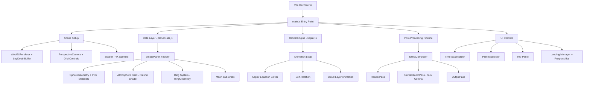
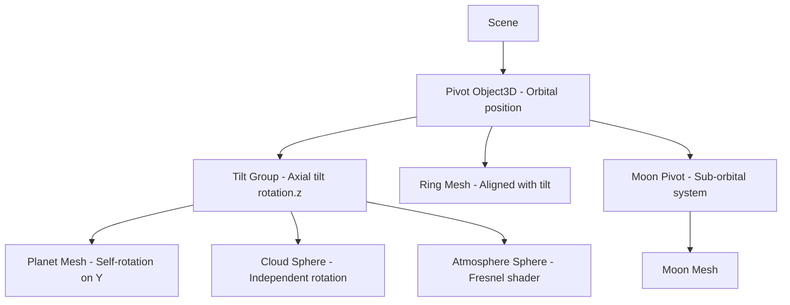

# 🌌 Kế Hoạch Triển Khai: Mô Phỏng Hệ Mặt Trời 3D

> **Dự án:** Solar System 3D Simulation  
> **Stack:** Vite + Three.js + Vanilla JS  
> **Deploy:** GitHub Pages via GitHub Actions  
> **Workspace:** `d:\solarsystemcat`

---

## Tổng Quan Kiến Trúc



---

## Phase 0: Khởi Tạo Dự Án
**Thời gian ước tính:** 15 phút

### Nhiệm vụ
| # | Task | Chi tiết |
|---|------|----------|
| 0.1 | Tạo Vite project | `npm create vite@latest ./ -- --template vanilla` |
| 0.2 | Cài dependencies | `npm install three` |
| 0.3 | Cấu hình `vite.config.js` | Set `base: '/solarsystemcat/'` cho GitHub Pages |
| 0.4 | Cấu trúc thư mục | Tạo `src/`, `public/textures/`, `public/textures/planets/` |
| 0.5 | Tạo GitHub Actions workflow | `.github/workflows/deploy.yml` |

### Cấu trúc thư mục mục tiêu
```
solarsystemcat/
├── .github/workflows/deploy.yml
├── public/
│   └── textures/
│       ├── stars/          # Skybox textures
│       └── planets/        # Planet texture maps
│           ├── sun/
│           ├── mercury/
│           ├── venus/
│           ├── earth/
│           ├── mars/
│           ├── jupiter/
│           ├── saturn/
│           ├── uranus/
│           ├── neptune/
│           └── pluto/
├── src/
│   ├── main.js             # Entry point
│   ├── scene.js            # Scene, Camera, Renderer setup
│   ├── planetData.js       # JSON data array
│   ├── createPlanet.js     # Factory function
│   ├── kepler.js           # Orbital mechanics solver
│   ├── atmosphere.js       # Fresnel shader
│   ├── rings.js            # Ring system builder
│   ├── postprocessing.js   # Bloom pipeline
│   ├── ui.js               # UI controls
│   └── constants.js        # Scale factors, colors
├── index.html
├── style.css
├── vite.config.js
└── package.json
```

---

## Phase 1: Scene Foundation
**Thời gian ước tính:** 30 phút

### 1.1 Renderer Setup (Bắt buộc)
```javascript
// Cấu hình CRITICAL - logarithmicDepthBuffer là BẮT BUỘC
const renderer = new THREE.WebGLRenderer({ 
  canvas,
  antialias: true, 
  logarithmicDepthBuffer: true  // Giải quyết Z-fighting
});
renderer.toneMapping = THREE.ACESFilmicToneMapping;
renderer.toneMappingExposure = 1.0;
```

### 1.2 Camera Setup
```javascript
const camera = new THREE.PerspectiveCamera(
  75,                                    // FOV
  window.innerWidth / window.innerHeight, // Aspect
  0.1,                                   // Near plane
  100000                                 // Far plane - cực xa
);
```

### 1.3 Skybox
- Sử dụng equirectangular starfield texture 4K
- Nguồn: Solar System Scope hoặc NASA SVS
- Áp dụng qua `scene.background = new THREE.CubeTextureLoader()...`

### 1.4 Lighting
- `PointLight` tại origin `(0, 0, 0)` — màu `0xffffee`, intensity cao
- `AmbientLight` cường độ rất thấp (~0.05) để các mặt tối không hoàn toàn đen

---

## Phase 2: Data Layer — Bảng Tham Số Thiên Thể
**Thời gian ước tính:** 45 phút

### 2.1 Hệ Thống Tỷ Lệ Kép (Dual-Scale)

| Tham số | Hệ số | Ghi chú |
|---------|-------|---------|
| **Khoảng cách** | 1 AU = 400 units | Hệ Mặt Trời nằm trong ~12,000 units |
| **Bán kính hành tinh** | Earth = 1 unit (base) | Tỷ lệ tương đối giữ nguyên |
| **Bán kính Mặt Trời** | Giới hạn ~25 units | Nén phi tuyến (thực tế 109x Earth) |

### 2.2 Bảng Dữ Liệu Hành Tinh (planetData.js)

| Thiên thể | Bán kính (Earth=1) | Bán trục lớn (AU) | Chu kỳ QĐ (ngày) | Độ lệch tâm | Nghiêng QĐ (°) | Nghiêng trục (°) | Tự quay (giờ) | Độ dẹt |
|-----------|--------------------|--------------------|-------------------|-------------|-----------------|-------------------|---------------|---------|
| **Mặt Trời** | ~25 (nén) | 0 | — | — | — | 7.25 | 609.12 | 0.00005 |
| **Sao Thủy** | 0.383 | 0.387 | 87.97 | 0.2056 | 7.0 | 0.034 | 1407.6 | 0.0000 |
| **Sao Kim** | 0.949 | 0.723 | 224.7 | 0.0068 | 3.39 | 177.4 | -5832.5 | 0.000 |
| **Trái Đất** | 1.000 | 1.000 | 365.2 | 0.0167 | 0.0 | 23.4 | 23.93 | 0.00335 |
| **Sao Hỏa** | 0.532 | 1.524 | 687.0 | 0.0934 | 1.85 | 25.2 | 24.62 | 0.00648 |
| **Sao Mộc** | 11.21 | 5.203 | 4331 | 0.0484 | 1.31 | 3.1 | 9.93 | 0.06487 |
| **Sao Thổ** | 9.45 | 9.537 | 10747 | 0.0542 | 2.49 | 26.7 | 10.66 | 0.09796 |
| **Thiên Vương** | 4.01 | 19.19 | 30589 | 0.0472 | 0.77 | 97.8 | -17.24 | 0.02293 |
| **Hải Vương** | 3.88 | 30.07 | 59800 | 0.0086 | 1.77 | 28.3 | 16.11 | 0.01708 |
| **Diêm Vương** | 0.186 | 39.48 | 90560 | 0.2444 | 17.2 | 122.5 | -153.3 | 0.000 |

### 2.3 Texture Maps Cần Thiết

| Thiên thể | Albedo | Normal/Bump | Specular | Night/Emission | Cloud | Ring | Atmosphere Color |
|-----------|--------|-------------|----------|----------------|-------|------|------------------|
| Mặt Trời | ✅ | — | — | — | — | — | — |
| Sao Thủy | ✅ | ✅ Bump | — | — | — | — | — (không KQ) |
| Sao Kim | ✅ Surface + ✅ Atmosphere | — | — | — | — | — | `#FFA500` orange |
| Trái Đất | ✅ | ✅ Normal | ✅ | ✅ City lights | ✅ | — | `#3B5B89` blue |
| Sao Hỏa | ✅ | ✅ Bump | — | — | — | — | `#C06030` faint |
| Sao Mộc | ✅ | — | — | — | — | — | — |
| Sao Thổ | ✅ | — | — | — | — | ✅ Ring alpha | `#C8A832` faint |
| Thiên Vương | ✅ | — | — | — | — | ✅ Faint ring | `#64B5C8` cyan |
| Hải Vương | ✅ | — | — | — | — | — | `#3264C8` deep blue |
| Diêm Vương | ✅ | — | — | — | — | — | — |

> [!TIP]
> **Nguồn texture miễn phí:** [Solar System Scope](https://www.solarsystemscope.com/textures/) (CC BY 4.0) — bao gồm Albedo, Normal, Specular, Cloud, Night maps cho phần lớn thiên thể.

---

## Phase 3: Planet Factory — createPlanet()
**Thời gian ước tính:** 1-2 giờ

### 3.1 Kiến trúc Parent-Child Hierarchy



### 3.2 Logic createPlanet(data)

```
function createPlanet(data):
  1. Tạo SphereGeometry(1, 64, 64)  // Normalized, scale sau
  2. Tải textures qua TextureLoader (async)
  3. Tạo MeshStandardMaterial với PBR maps
  4. Tạo Mesh, set scale theo radius
  5. Áp dụng oblateness: mesh.scale.set(1, 1 - data.oblateness, 1)
  6. Tạo Pivot (Object3D) → add Mesh as child
  7. Nếu có atmosphere → tạo AtmosphereSphere (Phase 4)
  8. Nếu có clouds → tạo CloudSphere
  9. Nếu có rings → tạo RingSystem (Phase 5)
  10. Nếu có moons → tạo Moon sub-orbits
  11. Xoay tilt group theo axialTilt (radian)
  12. Return { pivot, mesh, data }
```

### 3.3 Xử Lý Đặc Biệt Theo Thiên Thể

| Thiên thể | Xử lý đặc biệt |
|-----------|-----------------|
| **Mặt Trời** | `MeshBasicMaterial` (tự phát sáng), PointLight tại center, UnrealBloomPass |
| **Sao Kim** | Retrograde rotation (giá trị âm), atmosphere texture ĐỤC che surface |
| **Trái Đất** | 6 texture layers (Albedo + Normal + Specular + Night + Cloud + Atmo), Moon sub-orbit |
| **Sao Mộc/Thổ** | `mesh.scale.set(1, 1 - oblateness, 1)` cho hình bầu dục |
| **Sao Thổ** | Ring system phức tạp với radial alpha gradient (Cassini gap) |
| **Thiên Vương** | Trục quay nghiêng 97.8° → ring system quay DỌC, vành đai faint màu xám-lam |
| **Hải Vương** | Vành đai gần invisible, màu xanh đậm nhất |

---

## Phase 4: Atmospheric Fresnel Shader
**Thời gian ước tính:** 1 giờ

### 4.1 Cơ chế
- Tạo sphere bọc ngoài (radius × 1.02)
- Custom `ShaderMaterial` với Fresnel equation
- `side: THREE.BackSide`, `transparent: true`, `depthWrite: false`

### 4.2 GLSL Core Logic
```glsl
// Fragment shader core
float fresnel = 1.0 - max(dot(viewDir, normal), 0.0);
float intensity = pow(fresnel, fresnelPower); // power 3-5
gl_FragColor = vec4(atmosphereColor, intensity * opacity);
```

### 4.3 Áp dụng
| Hành tinh | Fresnel Power | Color | Opacity | Ghi chú |
|-----------|---------------|-------|---------|---------|
| Sao Kim | 2.0 | Orange #FFA500 | 0.9 | Đục, che phủ bề mặt |
| Trái Đất | 4.0 | Blue #3B5B89 | 0.6 | Hào quang xanh rìa |
| Sao Hỏa | 5.0 | Red-brown | 0.2 | Rất mỏng |
| Sao Thổ | 4.0 | Gold-yellow | 0.15 | Mờ nhạt |
| Thiên Vương | 3.5 | Cyan #64B5C8 | 0.4 | Methane glow |
| Hải Vương | 3.5 | Deep blue #3264C8 | 0.5 | Methane đậm hơn |

---

## Phase 5: Ring Systems
**Thời gian ước tính:** 1 giờ

### 5.1 Sao Thổ — Ring phức tạp

```
RingGeometry(innerRadius, outerRadius, 128)
Material: MeshStandardMaterial
  - map: ring color texture (radial gradient)
  - alphaMap: transparency gradient (Cassini gap = transparent)
  - side: THREE.DoubleSide
  - transparent: true
  - depthWrite: false
```

**Bảng phân vùng (chuẩn hóa theo bán kính hành tinh):**

| Vành | R trong (km) | R ngoài (km) | Optical Depth | Biểu hiện |
|------|-------------|-------------|---------------|-----------|
| D | 66,900 | 74,658 | ~10⁻⁵ | Gần invisible |
| C | 74,658 | 91,975 | 0.05-0.35 | Mờ |
| B | 91,975 | 117,507 | 0.4-2.5 | Sáng nhất, đục |
| Cassini | 117,507 | 122,340 | ~0 | Khe trống |
| A | 122,340 | 136,780 | 0.4-1.0 | Sáng vừa |
| F | 140,194 | 140,244 | 0.1-1.0 | Rất hẹp |

### 5.2 Thiên Vương — Ring đặc biệt
- Vành đai rất nhạt (xám-lam), alpha cực thấp
- **Xoay 97.8°** theo trục nghiêng cực đoan → ring gần VUÔNG GÓC với hoàng đạo
- Range: 38,000 km → 51,149 km (epsilon ring)

### 5.3 Hải Vương — Ring invisible
- Optical depth cực thấp, chỉ render nếu zoom gần
- Có thể bỏ qua hoặc render rất mờ

---

## Phase 6: Kepler Orbital Engine
**Thời gian ước tính:** 1 giờ

### 6.1 Thuật toán Newton-Raphson cho phương trình Kepler

```javascript
function solveKepler(M, e, tolerance = 1e-10, maxIter = 100) {
  let E = M; // Initial guess
  for (let i = 0; i < maxIter; i++) {
    const dE = (E - e * Math.sin(E) - M) / (1 - e * Math.cos(E));
    E -= dE;
    if (Math.abs(dE) < tolerance) return E;
  }
  return E;
}
```

### 6.2 Pipeline tính vị trí mỗi frame

```
1. t = Date.now() * timeScale
2. M = (2π / T) * t + φ₀           // Mean Anomaly
3. E = solveKepler(M, e)            // Eccentric Anomaly (Newton-Raphson)
4. x = a * (cos(E) - e)            // Position on orbital plane
5. z = a * sqrt(1-e²) * sin(E)     // Position on orbital plane
6. Apply rotation matrix for inclination (i) → get 3D world position
7. pivot.position.set(x, y_inclined, z)
```

### 6.3 Self-Rotation mỗi frame
```javascript
// Trong animation loop
mesh.rotation.y += (2 * Math.PI) / (rotationPeriodHours * 3600) * deltaTime * timeScale;
```

---

## Phase 7: Post-Processing — Sun Bloom
**Thời gian ước tính:** 30 phút

### 7.1 Setup EffectComposer

```javascript
import { EffectComposer } from 'three/addons/postprocessing/EffectComposer.js';
import { RenderPass } from 'three/addons/postprocessing/RenderPass.js';
import { UnrealBloomPass } from 'three/addons/postprocessing/UnrealBloomPass.js';
import { OutputPass } from 'three/addons/postprocessing/OutputPass.js';

const composer = new EffectComposer(renderer);
composer.addPass(new RenderPass(scene, camera));
composer.addPass(new UnrealBloomPass(
  new THREE.Vector2(width, height),
  2.0,   // Strength (1.5-2.5 theo spec)
  0.4,   // Radius
  0.1    // Threshold thấp → chỉ Sun vượt ngưỡng
));
composer.addPass(new OutputPass());
```

### 7.2 Selective Bloom
- Mặt Trời dùng `MeshBasicMaterial` → luôn full brightness → vượt bloom threshold
- Các hành tinh dùng `MeshStandardMaterial` → tối hơn → không bị bloom
- Trong animation loop: `composer.render()` thay vì `renderer.render()`

---

## Phase 8: UI/UX Controls
**Thời gian ước tính:** 1-2 giờ

### 8.1 Loading Screen
- `THREE.LoadingManager` tracking tất cả textures
- Progress bar hiển thị % tải
- Fade out khi hoàn tất

### 8.2 Controls Panel (glassmorphism design)

| Control | Loại | Chức năng |
|---------|------|-----------|
| Time Scale | Range slider | 0.1x → 100x tốc độ thời gian |
| Pause/Play | Toggle button | Dừng/chạy animation |
| Planet Selector | Dropdown/Buttons | Click → camera fly-to hành tinh |
| Orbit Lines | Toggle | Hiện/ẩn đường quỹ đạo |
| Labels | Toggle | Hiện/ẩn tên hành tinh |
| Info Panel | Side panel | Hiển thị dữ liệu vật lý khi chọn hành tinh |

### 8.3 Camera Controls
- `OrbitControls` cho zoom/pan/rotate tự do
- Camera fly-to animation khi chọn hành tinh (GSAP hoặc manual lerp)
- Min/max distance clamp

### 8.4 Responsive Design
- Event listener `window.resize` → cập nhật camera aspect + renderer size + composer size
- Touch support cho mobile

---

## Phase 9: Polish & Optimization
**Thời gian ước tính:** 1 giờ

### 9.1 Visual Polish
- Orbit path lines (`EllipseCurve` + `Line`)
- Planet name labels (CSS2DRenderer hoặc sprite)
- Smooth camera transitions
- Micro-animations cho UI elements

### 9.2 Performance
- Texture resolution: 2K cho inner planets, 2K cho gas giants, 1K cho outer
- `SphereGeometry` segments: 64 cho visible planets, 32 cho distant
- Dispose textures/geometries khi không cần
- RequestAnimationFrame with delta time

---

## Phase 10: Deployment
**Thời gian ước tính:** 15 phút

### 10.1 vite.config.js
```javascript
export default {
  base: '/solarsystemcat/',
  build: {
    assetsInlineLimit: 0, // Không inline textures
  }
}
```

### 10.2 GitHub Actions Workflow
```yaml
name: Deploy to GitHub Pages
on:
  push:
    branches: ['main']
permissions:
  contents: read
  pages: write
  id-token: write
jobs:
  deploy:
    environment:
      name: github-pages
      url: ${{ steps.deployment.outputs.page_url }}
    runs-on: ubuntu-latest
    steps:
      - uses: actions/checkout@v4
      - uses: actions/setup-node@v4
        with:
          node-version: 20
          cache: 'npm'
      - run: npm install
      - run: npm run build
      - uses: actions/configure-pages@v5
      - uses: actions/upload-pages-artifact@v3
        with:
          path: 'dist'
      - uses: actions/deploy-pages@v4
        id: deployment
```

---

## Thứ Tự Thực Hiện Đề Xuất

```mermaid
gantt
    title Lộ Trình Triển Khai
    dateFormat X
    axisFormat %s

    section Foundation
    Phase 0 - Project Setup         :p0, 0, 15
    Phase 1 - Scene Foundation      :p1, after p0, 30

    section Core
    Phase 2 - Data Layer            :p2, after p1, 45
    Phase 3 - Planet Factory        :p3, after p2, 120
    Phase 6 - Kepler Engine         :p6, after p3, 60

    section Visual Effects
    Phase 4 - Atmosphere Shader     :p4, after p6, 60
    Phase 5 - Ring Systems          :p5, after p4, 60
    Phase 7 - Sun Bloom             :p7, after p5, 30

    section UX
    Phase 8 - UI Controls           :p8, after p7, 120
    Phase 9 - Polish                :p9, after p8, 60

    section Deploy
    Phase 10 - Deployment           :p10, after p9, 15
```



> **Tổng thời gian ước tính: ~8-10 giờ** (coding liên tục)

---

## Rủi Ro & Giải Pháp

| Rủi ro | Mức | Giải pháp |
|--------|-----|-----------|
| Texture files quá lớn cho GitHub | Cao | Sử dụng 2K resolution, nén WebP/JPEG, hoặc load từ CDN |
| Z-fighting ở khoảng cách xa | Cao | `logarithmicDepthBuffer: true` — **BẮT BUỘC** |
| Bloom ảnh hưởng tất cả objects | Trung bình | Điều chỉnh threshold; Sun dùng BasicMaterial, planets dùng StandardMaterial |
| Performance trên mobile | Trung bình | Giảm texture resolution, giảm sphere segments, throttle animation |
| Gimbal lock khi xoay trục | Thấp | Parent-child hierarchy tách biệt tịnh tiến và quay |

---

## Checklist Nghiệm Thu

- [x] Tất cả 9 thiên thể + Mặt Trời hiển thị đúng tỷ lệ tương đối
- [x] Quỹ đạo elip với vận tốc biến thiên (Kepler's 2nd law)
- [x] Mặt Trời phát sáng với bloom corona
- [x] Trái Đất có 6 layer textures (bao gồm đèn đêm + mây)
- [x] Sao Thổ có ring system với Cassini gap
- [x] Thiên Vương có trục nghiêng 97.8° + ring dọc
- [x] Sao Kim quay ngược chiều
- [x] Không Z-fighting ở mọi khoảng cách zoom
- [x] Camera fly-to khi chọn hành tinh
- [x] Time scale control hoạt động
- [x] Loading progress bar
- [x] Responsive trên desktop + mobile
- [x] Deploy thành công lên GitHub Pages
- [x] Skybox 4K bao phủ toàn bộ nền
