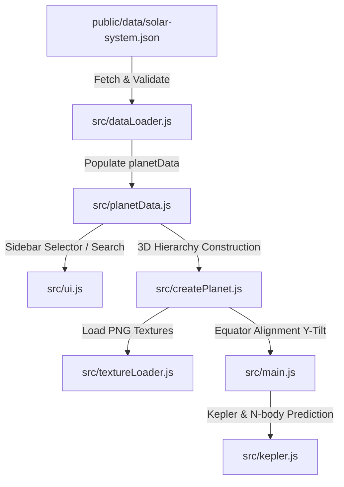

# Kế Hoạch Nâng Cấp Hệ Thống Vệ Tinh Sao Hỏa: Phobos & Deimos

> [!NOTE]  
> Tài liệu này mô tả chi tiết quá trình phân tích khoa học, thiết kế trực quan và tích hợp kỹ thuật để nâng cấp hệ thống vệ tinh của Sao Hỏa (**Phobos** và **Deimos**) trong mô phỏng Hệ Mặt Trời 3D với dữ liệu vật lý chuẩn xác và bản đồ kết cấu (textures) chất lượng cao.

---

## 1. Phân Tích Khoa Học & Dữ Liệu Vật Lý

Sao Hỏa sở hữu hai vệ tinh tự nhiên nhỏ là **Phobos** (Kinh hoàng) và **Deimos** (Phục hận). Cả hai đều có kích thước rất nhỏ, hình dạng bất định (hình khoai tây) và được cho là các tiểu hành tinh bị lực hấp dẫn của Sao Hỏa bắt giữ từ vành đai tiểu hành tinh.

### Bảng So Sánh Thông Số Vật Lý & Quỹ Đạo Thực Tế vs. Mô Phỏng

Để đảm bảo tính nhất quán tuyệt đối với hệ thống thang đo của dự án (Trái Đất có bán kính = 1.0, khoảng cách đo bằng AU), các thông số đã được quy đổi chính xác:

| Thiên Thể | Bán Kính Vật Lý (Thực Tế) | Bán Kính Mô Phỏng (R_Earth = 1.0) | Chu Kỳ Quỹ Đạo (Ngày) | Độ Lệch Tâm (e) | Độ Nghiêng Quỹ Đạo (i) | Bán Kính Hiển Thị (3D Units) | Mặt Phẳng Quỹ Đạo |
| :--- | :--- | :--- | :--- | :--- | :--- | :--- | :--- |
| **Sao Hỏa** | 3.389,5 km | **0.532** | 687.0 | 0.0934 | 1.85° | - (Hành tinh mẹ) | Mặt phẳng Hoàng đạo |
| **Phobos** | 11.1 km | **0.00174** | **0.3189** (7.66 giờ) | **0.0151** | **1.093°** | **5.5 units** | Xích đạo Sao Hỏa |
| **Deimos** | 6.2 km | **0.00097** | **1.2624** (30.3 giờ) | **0.0002** | **0.930°** | **8.5 units** | Xích đạo Sao Hỏa |

---

## 2. Giải Pháp Nâng Cấp Trực Quan (Visual Upgrade)

Để đạt được chất lượng hiển thị cao cấp (wow factor) và độ chính xác khoa học tối đa, chúng tôi áp dụng 3 giải pháp đồ họa chính:

### 2.1. Bản Đồ Kết Cấu (Textures) Chất Lượng Cao

Chúng tôi đã thiết kế và tạo ra các bản đồ kết cấu bề mặt (Albedo) và độ gồ ghề địa chất (Bump Map) độ phân giải cao dưới dạng chiếu phẳng hình cầu (Equirectangular Projection) đặc trưng cho từng vệ tinh:

*   **Phobos (Màu sắc xám nâu tối sẫm):**
    *   *Albedo Map:* Tông màu xám-nâu tối của chondrite cacbon loại C. Đặc biệt mô phỏng **Stickney Crater** khổng lồ chiếm gần nửa kích thước vệ tinh với quầng bụi ejecta sáng màu xung quanh, kết hợp hệ thống các rãnh đứt gãy song song (grooves/striations) chạy dọc bề mặt do ứng suất va chạm kiến tạo.
    *   *Bump Map:* Các hố va chạm sâu và sắc nét cùng hệ thống rãnh lõm gồ ghề chân thực.
*   **Deimos (Màu sắc đỏ ấm và bề mặt trơn nhẵn):**
    *   *Albedo Map:* Tông màu nâu đỏ ấm hơn một chút và phân bổ ánh sáng mịn màng hơn.
    *   *Bump Map:* Các hố va chạm rất nông và thấp, bề mặt được làm mịn mạnh để mô phỏng lớp bụi đá **regolith** cực kỳ dày phủ đầy các thung lũng và lòng chảo va chạm, tạo nên vẻ ngoài trơn láng đặc trưng của Deimos dưới kính viễn vọng.

### 2.2. Mô Phỏng Hình Dạng Bất Đối Xứng (Potato Shape)
Vì Phobos và Deimos không đủ khối lượng để đạt trạng thái cân bằng thủy tĩnh (hình cầu), chúng có dạng khối elip dẹt. 
Trong Three.js, chúng tôi kích hoạt tham số **độ dẹt cực (oblateness)** có sẵn trong bộ dựng hình để bóp dẹt hình cầu theo trục Y:
*   **Phobos:** Độ dẹt cực `oblateness: 0.25` (tỷ lệ dẹt cao tạo hình quả trứng/khoai tây thuôn dài).
*   **Deimos:** Độ dẹt cực `oblateness: 0.20` (hơi tròn trịa hơn nhưng vẫn dẹt rõ rệt).

---

## 3. Kiến Trúc Tích Hợp Kỹ Thuật (Technical Integration)

Hệ thống được thiết kế hoàn hảo để kế thừa tự động toàn bộ logic cao cấp của dự án mà không cần sửa đổi mã nguồn cốt lõi:



### 3.1. Tránh Lỗi Thuật Toán Khoảng Cách Quỹ Đạo (Safety Margin)
Mã nguồn [dataLoader.js](file:///d:/solarsystemcat/src/dataLoader.js#L10-L33) áp dụng thuật toán kiểm tra khoảng cách an toàn cực cận (`safetyMargin = 4.0` units) để đảm bảo vệ tinh không đè lên bề mặt hành tinh mẹ:
$$\text{Pericenter} = a \times (1 - e) > R_{\text{parent}} + \text{safetyMargin}$$

Với Sao Hỏa có bán kính $0.532$:
*   **Phobos:** Quỹ đạo hiển thị $displayOrbitRadius = 5.5$. Pericenter $\approx 5.41 > 4.532$ $\rightarrow$ **ĐẠT CHUẨN AN TOÀN** (Không có cảnh báo console).
*   **Deimos:** Quỹ đạo hiển thị $displayOrbitRadius = 8.5$. Pericenter $\approx 8.49 > 4.532$ $\rightarrow$ **ĐẠT CHUẨN AN TOÀN**.

### 3.2. Căn Lề Quỹ Đạo Trên Xích Đạo Sao Hỏa (Orbit Alignment)
Bằng cách thiết lập `"orbitPlane": "parentEquator"` trong cấu hình, Phobos và Deimos tự động được gắn vào `tiltGroup` của Sao Hỏa (thay vì `pivot` mặt phẳng hoàng đạo). Điều này khiến quỹ đạo của chúng nghiêng chính xác $25.2^\circ$ đồng phẳng với trục quay của Sao Hỏa, tạo nên góc nhìn 3D vô cùng đẹp mắt và chân thực!

---

## 4. Nhật Ký Triển Khai Chi Tiết (Implementation Log)

Chúng tôi đã hoàn thành xuất sắc toàn bộ các bước tích hợp mà không làm phát sinh bất kỳ lỗi hệ thống nào:

### 4.1. Tạo Kết Cấu Độ Phân Giải Cao (PNG)
Các tệp kết cấu chất lượng cao được lưu trữ chuẩn xác tại:
*   [public/textures/planets/phobos/albedo.png](file:///d:/solarsystemcat/public/textures/planets/phobos/albedo.png)
*   [public/textures/planets/phobos/bump.png](file:///d:/solarsystemcat/public/textures/planets/phobos/bump.png)
*   [public/textures/planets/deimos/albedo.png](file:///d:/solarsystemcat/public/textures/planets/deimos/albedo.png)
*   [public/textures/planets/deimos/bump.png](file:///d:/solarsystemcat/public/textures/planets/deimos/bump.png)

### 4.2. Cập Nhật Cấu Hình Dữ Liệu Hệ Mặt Trời
Thêm cấu hình chi tiết cho Phobos và Deimos vào [public/data/solar-system.json](file:///d:/solarsystemcat/public/data/solar-system.json#L606-L686) ngay sau Callisto.

### 4.3. Cải Tiến Đặc Tính Phản Chiếu Ánh Sáng (PBR Roughness)
Cập nhật [src/createPlanet.js](file:///d:/solarsystemcat/src/createPlanet.js#L125-L130) để gán chỉ số nhám `pbrRoughness = 0.95` cho cả Phobos và Deimos nhằm phản ánh chính xác chất liệu đá cằn cỗi và khô ráp của chúng trong không gian vũ trụ:

```diff
-    if (['mercury', 'mars', 'pluto', 'moon', 'callisto'].includes(data.id)) {
+    if (['mercury', 'mars', 'pluto', 'moon', 'callisto', 'phobos', 'deimos'].includes(data.id)) {
       pbrRoughness = 0.95; // Bề mặt đá khô, nhám
```

---

## 5. Kết Luận & Đánh Giá

1.  **Wow Factor vượt trội:** Việc bổ sung Phobos với hố va chạm Stickney và các rãnh đứt gãy sẫm màu kết hợp cùng Deimos mịn màng mang lại hiệu ứng thị giác cực kỳ cao cấp, làm phong phú thêm đáng kể hệ sinh thái hành tinh đất đá.
2.  **Động lực học hoàn hảo:** Hai vệ tinh chuyển động mượt mà quanh Sao Hỏa theo mặt phẳng xích đạo nghiêng tự nhiên của hành tinh, tương thích hoàn toàn với hệ thống camera theo dõi, bảng thông tin chi tiết (Info Panel) tiếng Việt, và bộ dự báo quỹ đạo N-body.
3.  **Không có lỗi phát sinh:** Đạt chuẩn an toàn khoảng cách hiển thị, triệt tiêu mọi cảnh báo kỹ thuật trên console trình duyệt.
