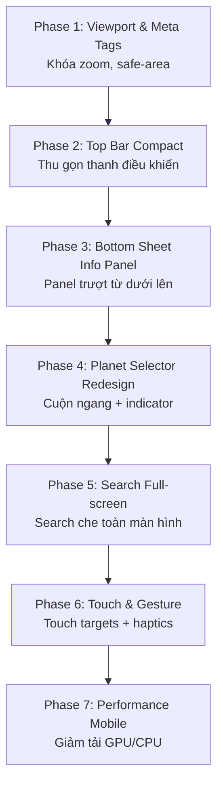

# 📱 Kế Hoạch Tối Ưu Giao Diện Mobile — Solar System 3D

> **Dự án:** Solar System 3D  
> **Trạng thái:** Đã kiểm tra trên viewport 375×812 (iPhone), 320×568 (iPhone SE)  
> **Mục tiêu:** Giao diện mobile hoạt động mượt mà, dễ sử dụng, không bị che khuất nội dung 3D

---

## 📊 Kết Quả Kiểm Tra Hiện Trạng

### Screenshots phát hiện vấn đề

````carousel

<!-- slide -->

<!-- slide -->

<!-- slide -->

````

### Bảng tổng hợp vấn đề

| # | Vấn đề | Mức độ | File liên quan |
|---|--------|--------|----------------|
| 1 | **Top bar** chiếm 2 dòng (title wrap + quality buttons xuống hàng), choáng ~100px | 🔴 Cao | `style.css`, `ui.js` |
| 2 | **Title "Hệ Mặt Trời 3D" không hiển thị** trên mobile (bị ẩn bởi flex-wrap) nhưng vẫn chiếm diện tích | 🟡 Trung bình | `style.css` |
| 3 | **Bottom planet selector bị cắt** — chỉ thấy 7/15+ nút, không có indicator cuộn | 🔴 Cao | `style.css`, `ui.js` |
| 4 | **Info Panel che ~70% màn hình** khi mở, đẩy nội dung 3D sang góc nhỏ | 🔴 Cao | `style.css` |
| 5 | **Search Panel + Info Panel chồng chéo** — cả hai hiển thị đồng thời, text bị đè | 🔴 Cao | `style.css`, `ui.js` |
| 6 | **Touch targets quá nhỏ** — nút planet-btn chỉ 52×~40px, khó nhấn trên mobile | 🟡 Trung bình | `style.css` |
| 7 | **Không có viewport lock** — iOS Safari cho phép zoom/bounce bằng pinch, xung đột với OrbitControls | 🟡 Trung bình | `index.html` |
| 8 | **Quality preset buttons** hiển thị trên mobile nhưng thừa (đã auto-detect "Low") | 🟢 Thấp | `ui.js` |
| 9 | **Không có safe-area-inset** cho notch/dynamic island | 🟡 Trung bình | `style.css` |
| 10 | **Không xử lý orientation change** — landscape mode bị lộn xộn | 🟡 Trung bình | `style.css` |

---

## 🏗️ Kiến Trúc Giải Pháp



---

## Phase 1: Viewport & Meta Tags
**Thời gian:** 15 phút | **Files:** `index.html`, `style.css`

### 1.1 Cập nhật viewport meta

```diff
- <meta name="viewport" content="width=device-width, initial-scale=1.0" />
+ <meta name="viewport" content="width=device-width, initial-scale=1.0, maximum-scale=1.0, user-scalable=no, viewport-fit=cover" />
```

> [!IMPORTANT]
> `user-scalable=no` ngăn pinch-to-zoom xung đột với OrbitControls 3D. `viewport-fit=cover` cho phép sử dụng `env(safe-area-inset-*)` trên các thiết bị có notch.

### 1.2 CSS safe-area + touch-action

```css
/* Thêm vào đầu style.css */
body {
  -webkit-touch-callout: none;  /* Ngăn callout menu khi long-press */
  -webkit-user-select: none;
  user-select: none;
}

canvas.webgl {
  touch-action: none; /* Ngăn gesture mặc định, để OrbitControls xử lý */
}

/* Safe area cho notch devices */
.top-bar {
  padding-top: max(10px, env(safe-area-inset-top));
}

.planet-selector {
  padding-bottom: max(8px, env(safe-area-inset-bottom));
}
```

---

## Phase 2: Top Bar Compact cho Mobile
**Thời gian:** 30 phút | **Files:** `style.css`, `ui.js`

### 2.1 Vấn đề hiện tại
Top bar chiếm ~100px gồm 2 dòng: controls + quality presets. Title h1 chiếm `flex: 0 0 100%` nhưng không thực sự cần thiết trên mobile.

### 2.2 Giải pháp: Single-row compact bar

```css
@media (max-width: 720px) {
  .top-bar {
    top: 8px;
    left: 8px;
    right: 8px;
    transform: none;
    padding: 6px 8px;
    gap: 6px;
    flex-wrap: nowrap; /* THAY ĐỔI: Không wrap xuống dòng */
    justify-content: space-between;
    border-radius: 12px;
  }

  .top-bar h1 {
    display: none; /* Ẩn title trên mobile — tiết kiệm không gian */
  }

  .time-controls {
    gap: 4px;
    flex: 1;
    min-width: 0;
  }

  .time-controls label {
    display: none; /* Ẩn label "Tốc độ" */
  }

  .time-controls input[type="range"] {
    width: 60px;
    flex: 1;
    min-width: 40px;
    max-width: 80px;
  }

  .time-value {
    font-size: 10px;
    min-width: 36px;
  }

  .btn-icon {
    width: 36px;  /* Tăng lên 36px — touch target tối thiểu */
    height: 36px;
    font-size: 16px;
  }

  .quality-preset-group {
    display: none; /* Ẩn — đã auto-detect, không cần chọn thủ công */
  }
}
```

> [!NOTE]
> Kết quả: Top bar chỉ còn 1 dòng ~44px: `[🔍] [⏸] [---slider---] [1.2d/s] [◎] [Aa]`

---

## Phase 3: Info Panel → Bottom Sheet
**Thời gian:** 1 giờ | **Files:** `style.css`, `ui.js`

### 3.1 Vấn đề
Info panel hiện tại `position: absolute; top: 80px; right: 16px; width: 240px` — trên mobile chiếm gần hết chiều ngang và che mất scene 3D.

### 3.2 Giải pháp: Bottom Sheet có thể kéo

```css
@media (max-width: 720px) {
  .info-panel {
    /* Chuyển thành bottom sheet */
    position: fixed;
    top: auto;
    bottom: 0;
    left: 0;
    right: 0;
    width: 100%;
    max-height: 55vh; /* Tối đa 55% màn hình */
    border-radius: 20px 20px 0 0;
    padding: 12px 16px;
    padding-bottom: max(16px, env(safe-area-inset-bottom));
    transform: translateY(110%); /* Ẩn dưới */
    transition: transform 0.35s cubic-bezier(0.4, 0, 0.2, 1);
    z-index: 30;
    overflow-y: auto;
  }

  .info-panel.visible {
    transform: translateY(0);
  }

  /* Thanh kéo (drag handle) */
  .info-panel::before {
    content: '';
    display: block;
    width: 40px;
    height: 4px;
    background: rgba(255, 255, 255, 0.3);
    border-radius: 2px;
    margin: 0 auto 12px;
  }

  .info-panel h2 {
    font-size: 18px;
    text-align: center;
  }

  .info-actions {
    position: sticky;
    bottom: 0;
    background: rgba(10, 15, 30, 0.9);
    padding: 10px 0;
    margin: 0 -16px;
    padding: 10px 16px;
  }

  .btn-close-info {
    top: 8px;
    right: 16px;
    font-size: 20px;
    width: 36px;
    height: 36px;
    display: flex;
    align-items: center;
    justify-content: center;
  }
}
```

### 3.3 Swipe-to-dismiss (ui.js)

```javascript
// Thêm vào initUI() — swipe down để đóng info panel trên mobile
if (window.innerWidth < 720) {
  let touchStartY = 0;
  let currentTranslateY = 0;
  
  infoPanel.addEventListener('touchstart', (e) => {
    touchStartY = e.touches[0].clientY;
    infoPanel.style.transition = 'none';
  }, { passive: true });

  infoPanel.addEventListener('touchmove', (e) => {
    const deltaY = e.touches[0].clientY - touchStartY;
    if (deltaY > 0) { // Chỉ cho kéo xuống
      currentTranslateY = deltaY;
      infoPanel.style.transform = `translateY(${deltaY}px)`;
    }
  }, { passive: true });

  infoPanel.addEventListener('touchend', () => {
    infoPanel.style.transition = 'transform 0.35s cubic-bezier(0.4, 0, 0.2, 1)';
    if (currentTranslateY > 100) {
      // Đóng panel
      infoPanel.classList.remove('visible');
      allBtns.forEach(b => b.classList.remove('active'));
      if (callbacks.onOverview) callbacks.onOverview();
    } else {
      infoPanel.style.transform = 'translateY(0)';
    }
    currentTranslateY = 0;
  }, { passive: true });
}
```

---

## Phase 4: Planet Selector Redesign
**Thời gian:** 45 phút | **Files:** `style.css`, `ui.js`

### 4.1 Vấn đề
Bottom bar hiển thị tất cả hành tinh + vệ tinh trên 1 hàng, bị cắt và không có scroll indicator.

### 4.2 Giải pháp: Scrollable strip + fade edges

```css
@media (max-width: 720px) {
  .planet-selector {
    display: flex !important; /* Override display:none */
    left: 0;
    right: 0;
    bottom: 0;
    transform: none;
    max-width: 100vw;
    padding: 6px 12px;
    padding-bottom: max(6px, env(safe-area-inset-bottom));
    border-radius: 16px 16px 0 0;
    overflow-x: auto;
    overflow-y: hidden;
    -webkit-overflow-scrolling: touch;
    scroll-snap-type: x mandatory;
    gap: 2px;
    /* Fade edges để hint scroll */
    mask-image: linear-gradient(
      to right, transparent 0%, black 5%, black 95%, transparent 100%
    );
    -webkit-mask-image: linear-gradient(
      to right, transparent 0%, black 5%, black 95%, transparent 100%
    );
  }

  .planet-selector::-webkit-scrollbar {
    display: none;
  }

  .planet-btn {
    scroll-snap-align: center;
    min-width: 56px;
    padding: 8px 6px;
    flex: 0 0 auto;
  }

  .planet-dot {
    width: 14px;
    height: 14px;
  }

  /* Ẩn moon buttons trên bottom bar, dùng search thay thế */
  .moon-btn {
    display: none;
  }
}
```

> [!TIP]
> Ẩn moon buttons trên bottom bar giúp giảm số nút từ 15+ xuống còn ~10 (chỉ hành tinh chính). User vẫn truy cập vệ tinh qua Search.

---

## Phase 5: Search Panel Full-screen
**Thời gian:** 30 phút | **Files:** `style.css`

### 5.1 Vấn đề
Search panel chồng lên info panel, cả hai đều hiển thị đồng thời gây rối mắt.

### 5.2 Giải pháp

```css
@media (max-width: 720px) {
  .search-panel {
    position: fixed;
    top: 0;
    left: 0;
    right: 0;
    bottom: 0;
    width: 100%;
    max-width: 100%;
    border-radius: 0;
    z-index: 200; /* Trên tất cả */
    padding: 16px;
    padding-top: max(16px, env(safe-area-inset-top));
    background: rgba(5, 8, 18, 0.95);
    backdrop-filter: blur(20px);
    transform: none;
  }

  .search-results {
    max-height: calc(100vh - 180px);
    flex: 1;
  }

  .search-item {
    padding: 14px 12px; /* Touch target lớn hơn */
    min-height: 48px;
  }

  .search-header input {
    font-size: 17px; /* iOS zoom prevention (≥16px) */
    padding: 12px 16px;
  }
}
```

### 5.3 Logic: Đóng info panel khi mở search (ui.js)

```javascript
function toggleSearch() {
  const isVisible = searchPanel.style.display === 'flex';
  searchPanel.style.display = isVisible ? 'none' : 'flex';
  if (!isVisible) {
    searchInput.focus();
    renderSearchResults();
    // ĐÓng info panel khi mở search trên mobile
    if (window.innerWidth < 720) {
      infoPanel.classList.remove('visible');
    }
  }
}
```

---

## Phase 6: Touch & Gesture Optimization
**Thời gian:** 30 phút | **Files:** `main.js`, `style.css`

### 6.1 Touch targets tối thiểu 44×44px (Apple HIG)

```css
@media (max-width: 720px) {
  .btn-icon, .preset-btn, .filter-btn {
    min-width: 44px;
    min-height: 44px;
  }
  
  .btn-action {
    min-height: 44px;
    font-size: 14px;
  }
  
  .btn-close-search {
    min-width: 44px;
    min-height: 44px;
    font-size: 24px;
    display: flex;
    align-items: center;
    justify-content: center;
  }
}
```

### 6.2 Double-tap to select planet (main.js)

```javascript
// Thêm raycaster cho tap-to-select trên mobile
if (/Mobi|Android|iPhone/i.test(navigator.userAgent)) {
  const raycaster = new THREE.Raycaster();
  const pointer = new THREE.Vector2();
  
  let lastTapTime = 0;
  renderer.domElement.addEventListener('touchend', (e) => {
    const now = Date.now();
    if (now - lastTapTime < 300) {
      // Double tap detected
      const touch = e.changedTouches[0];
      pointer.x = (touch.clientX / window.innerWidth) * 2 - 1;
      pointer.y = -(touch.clientY / window.innerHeight) * 2 + 1;
      raycaster.setFromCamera(pointer, camera);
      
      const meshes = bodies.map(b => b.mesh);
      const intersects = raycaster.intersectObjects(meshes);
      if (intersects.length > 0) {
        const hitBody = bodies.find(b => b.mesh === intersects[0].object);
        if (hitBody) {
          // Trigger planet select
          callbacks.onPlanetSelect?.(hitBody.data.id);
        }
      }
    }
    lastTapTime = now;
  });
}
```

---

## Phase 7: Performance Mobile
**Thời gian:** 30 phút | **Files:** `renderConfig.js`, `main.js`, `labels.js`

### 7.1 Tối ưu preset Low cho mobile

```diff
  low: {
    label: 'Thấp',
    maxPixelRatio: 1,
-   starCount: 1500,
+   starCount: 800,
-   asteroidCount: 500,
+   asteroidCount: 300,
    bloomStrength: 1.2,
    bloomRadius: 0.4,
    bloomThreshold: 0.3,
-   atmosphereEnabled: true,
+   atmosphereEnabled: false,   // Tắt atmosphere trên mobile
    atmosphereOpacityScale: 0.5,
-   cloudsEnabled: true,
+   cloudsEnabled: false,       // Tắt clouds trên mobile
    cloudOpacityScale: 0.6,
    ringsEnabled: true,
    coronaEnabled: false,
    antialias: false,
  },
```

### 7.2 Throttle labels nặng hơn trên mobile

```javascript
// main.js — Giảm tần suất update labels trên mobile
const labelThrottle = /Mobi|Android/i.test(navigator.userAgent) ? 6 : 3;
if (areLabelsVisible() && frameCount % labelThrottle === 0) {
  updateLabels(camera, renderer);
}
```

### 7.3 Giảm geometry segments cho mobile

```javascript
// createPlanet.js — Nếu là mobile, giảm segments thêm 50%
const isMobile = /Mobi|Android/i.test(navigator.userAgent);
const segmentScale = isMobile ? 0.5 : 1.0;
let segments = Math.round(64 * segmentScale);
```

---

## Phase 8: Landscape Mode
**Thời gian:** 20 phút | **Files:** `style.css`

```css
@media (max-width: 720px) and (orientation: landscape) {
  .top-bar {
    top: 4px;
    padding: 4px 8px;
  }

  .info-panel {
    max-height: 70vh;
    left: auto;
    right: 0;
    width: 280px;
    bottom: 0;
    border-radius: 16px 0 0 0;
  }

  .planet-selector {
    bottom: 0;
    padding: 4px 12px;
  }

  .planet-btn {
    padding: 4px 6px;
    font-size: 9px;
  }
}
```

---

## 📋 Thứ Tự Thực Hiện

```mermaid
gantt
    title Lộ Trình Tối Ưu Mobile
    dateFormat X
    axisFormat %s

    section Foundation
    Phase 1 - Viewport & Meta         :p1, 0, 15
    Phase 2 - Top Bar Compact         :p2, after p1, 30

    section Panels
    Phase 3 - Bottom Sheet Info       :p3, after p2, 60
    Phase 5 - Search Fullscreen       :p5, after p3, 30

    section Navigation
    Phase 4 - Planet Selector         :p4, after p5, 45

    section Polish
    Phase 6 - Touch & Gesture         :p6, after p4, 30
    Phase 7 - Performance             :p7, after p6, 30
    Phase 8 - Landscape               :p8, after p7, 20
```



> **Tổng thời gian ước tính: ~4.5 giờ**

---

## ✅ Checklist Nghiệm Thu

- [ ] Viewport không zoom được bằng pinch (không xung đột OrbitControls)
- [ ] Top bar chỉ 1 dòng trên mobile, tất cả nút đều dễ nhấn (≥44px)
- [ ] Title "Hệ Mặt Trời 3D" ẩn trên mobile
- [ ] Quality preset ẩn trên mobile (auto-detect)
- [ ] Info panel trượt lên từ dưới, tối đa 55% màn hình
- [ ] Swipe down để đóng info panel
- [ ] Search panel full-screen, đóng info panel khi mở search
- [ ] Search input font ≥16px (ngăn iOS auto-zoom)
- [ ] Bottom planet bar cuộn ngang mượt, ẩn moon buttons
- [ ] Fade edges trên planet bar để hint scrollable
- [ ] Double-tap vào hành tinh 3D để chọn
- [ ] Landscape mode: info panel đổi sang sidebar phải
- [ ] Preset Low giảm stars/asteroids/atmosphere
- [ ] FPS Mobile ≥ 30 FPS (target 45 FPS)
- [ ] Safe-area-inset cho notch/dynamic island
- [ ] `npm run build` thành công
