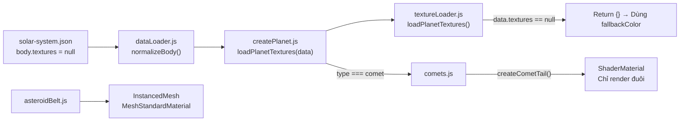
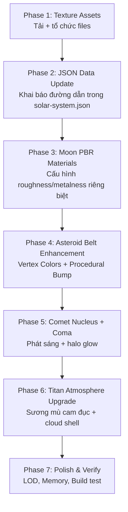

# 🌑 Kế Hoạch Nâng Cao Bề Mặt Vệ Tinh & Sao Chổi 3D

> **Dự án:** Solar System 3D — Moons & Small Bodies Surface Quality Enhancement  
> **Trạng thái hiện tại:** 6 vệ tinh + 1 sao chổi + ~3000 tiểu hành tinh đã có trong scene nhưng toàn bộ đều dùng `fallbackColor` đơn sắc.  
> **Mục tiêu:** Đưa chất lượng bề mặt các thiên thể phụ lên ngang tầm với các hành tinh chính đã được nâng cấp PBR.

---

## 📊 Đánh Giá Hiện Trạng (Chi Tiết Kỹ Thuật)

### Hiện trạng theo từng thiên thể

| Thiên thể | Trạng thái hiện tại | Vấn đề cụ thể |
|-----------|---------------------|---------------|
| Moon (Mặt Trăng) | `textures.albedo` được khai báo trong JSON nhưng **file không tồn tại** | Lỗi 404 tại `/textures/planets/moon/albedo.jpg`. Thư mục `moon/` chưa tồn tại trong `public/textures/planets/`. |
| Io | `"textures": null` trong JSON | Không có albedo, render bằng fallbackColor `#E8C84A`. |
| Europa | `"textures": null` trong JSON | Không có albedo, render bằng fallbackColor `#C8B896`. |
| Ganymede | `"textures": null` trong JSON | Không có albedo, render bằng fallbackColor `#8C8478`. |
| Callisto | `"textures": null` trong JSON | Không có albedo, render bằng fallbackColor `#6B6050`. |
| Titan | `"textures": null`, **đã có** `atmosphere` config | Bề mặt fallbackColor `#D4A840`, khí quyển Fresnel màu cam hoạt động. |
| Halley | `"textures": null`, type `"comet"` | Lõi (nucleus) là quả cầu đơn sắc `#AACCFF`. Đuôi ShaderMaterial đã hoạt động. |
| Asteroid Belt | InstancedMesh với `MeshStandardMaterial({ color: 0x888888 })` | Tất cả 3000 instances chia sẻ chung 1 material xám, không bump, không vertex color variation. |

### Kiến trúc code liên quan



**Điểm mấu chốt:** Pipeline `textureLoader.js` đã hoàn chỉnh và hỗ trợ `albedo`, `normal`, `bump`. Chỉ cần:
1. Đặt file texture vào đúng thư mục.
2. Cập nhật `"textures"` trong JSON từ `null` thành object chứa các đường dẫn.

---

## 🏗️ Kiến Trúc Nâng Cấp



---

## Phase 1: Thu Thập & Tổ Chức Texture Assets
**Thời gian ước tính:** 45 phút

### 1.1 Nguồn Texture
- **Chính:** [Solar System Scope](https://www.solarsystemscope.com/textures/) (CC BY 4.0) — đã dùng cho hành tinh chính
- **Phụ:** [JHT's Planetary Pixel Emporium](https://planetpixelemporium.com/) — bổ sung bump maps
- **USGS Astrogeology:** Các ảnh bề mặt chính xác khoa học cho Galilean moons

### 1.2 Bảng Texture (Độ phân giải 1K)

> [!IMPORTANT]
> Vệ tinh nhỏ hơn hành tinh rất nhiều. Texture **1K (1024×512)** là đủ cho tất cả moons — tiết kiệm ~60% dung lượng so với 2K.

| Thiên thể | albedo.jpg | bump/normal | Kích thước ước tính | Lý do chọn texture |
|-----------|-----------|-------------|--------------------|--------------------|
| Moon | ✅ Albedo | ✅ bump.jpg | ~150KB + ~120KB | Hố thiên thạch, mare basalt rõ nét |
| Io | ✅ Albedo | ✅ normal.jpg | ~180KB + ~150KB | Bề mặt lưu huỳnh vàng cam đỏ loang lổ |
| Europa | ✅ Albedo | ✅ bump.jpg | ~120KB + ~100KB | Vết nứt băng lineae trên nền trắng |
| Ganymede | ✅ Albedo | ✅ normal.jpg | ~160KB + ~130KB | Vùng sáng/tối rõ rệt (sulci + cratered terrain) |
| Callisto | ✅ Albedo | ✅ bump.jpg | ~150KB + ~120KB | Bề mặt cổ nhất, đầy hố va chạm |
| Titan | ✅ Albedo | — | ~100KB | Bề mặt mờ ảo dưới lớp sương mù, không cần bump |

**Tổng dung lượng thêm:** ~1.5MB (chấp nhận được với giới hạn 30MB tổng)

### 1.3 Tạo thư mục mới
```bash
# Cần tạo 6 thư mục mới trong public/textures/planets/
mkdir -p public/textures/planets/{moon,io,europa,ganymede,callisto,titan}
```

### 1.4 Giới hạn kỹ thuật
- JPEG quality 80%, resolution 1024×512
- Wrap mode `RepeatWrapping` (mặc định Three.js `TextureLoader`)
- Đặt tên file **chính xác theo convention đã có:** `albedo.jpg`, `bump.jpg`, `normal.jpg`

---

## Phase 2: Cập Nhật Data JSON
**Thời gian ước tính:** 20 phút

### 2.1 Cập nhật `solar-system.json`

Thay `"textures": null` bằng object cụ thể cho từng vệ tinh. Ví dụ:

```diff
  {
    "id": "moon",
    ...
-   "textures": {
-     "albedo": "/textures/planets/moon/albedo.jpg"
-   },
+   "textures": {
+     "albedo": "/textures/planets/moon/albedo.jpg",
+     "bump": "/textures/planets/moon/bump.jpg"
+   },
```

```diff
  {
    "id": "io",
    ...
-   "textures": null,
+   "textures": {
+     "albedo": "/textures/planets/io/albedo.jpg",
+     "normal": "/textures/planets/io/normal.jpg"
+   },
```

> [!NOTE]
> Không cần sửa `textureLoader.js` — hàm `loadPlanetTextures(data)` đã xử lý tất cả các key (`albedo`, `normal`, `bump`, `specular`, `night`, `clouds`, `atmosphere`, `ring`) một cách tự động dựa trên sự tồn tại trong `data.textures`.

### 2.2 Bảng cập nhật đầy đủ

| Body ID | textures (mới) |
|---------|---------------|
| `moon` | `{ albedo, bump }` |
| `io` | `{ albedo, normal }` |
| `europa` | `{ albedo, bump }` |
| `ganymede` | `{ albedo, normal }` |
| `callisto` | `{ albedo, bump }` |
| `titan` | `{ albedo }` |
| `halley` | Giữ `null` — lõi sao chổi quá nhỏ (0.05 radius), texture không hiệu quả, xử lý bằng procedural ở Phase 5. |

---

## Phase 3: Cấu Hình PBR Material Cho Vệ Tinh
**Thời gian ước tính:** 1 giờ

### 3.1 Vấn đề hiện tại trong `createPlanet.js`

Hiện tại block PBR (dòng 68-78) **chỉ tùy chỉnh cho hành tinh chính**, mọi vệ tinh đều nhận giá trị mặc định `roughness: 0.8, metalness: 0.0`. Điều này sai về mặt vật lý:
- Europa có bề mặt **băng** → roughness rất thấp (~0.3), phản chiếu mạnh
- Io có bề mặt **lưu huỳnh nóng chảy** → roughness trung bình, emissive nhẹ
- Moon/Callisto có bề mặt **đá regolith** → roughness rất cao (~0.95)

### 3.2 Bảng cấu hình Material chi tiết

| Body ID | Material Type | roughness | metalness | bumpScale | emissive | Ghi chú |
|---------|--------------|-----------|-----------|-----------|----------|---------|
| moon | `MeshStandardMaterial` | 0.95 | 0.0 | 0.04 | — | Regolith, giống Mercury |
| io | `MeshStandardMaterial` | 0.7 | 0.0 | — | `0x331100` (0.15) | Lưu huỳnh nóng, glow nhẹ vùng núi lửa |
| europa | `MeshStandardMaterial` | 0.25 | 0.05 | 0.02 | — | Băng phản chiếu, bump nhẹ cho vết nứt |
| ganymede | `MeshStandardMaterial` | 0.6 | 0.0 | — | — | Pha trộn băng và đá |
| callisto | `MeshStandardMaterial` | 0.9 | 0.0 | 0.05 | — | Đá cổ nhất, đầy crater |
| titan | `MeshStandardMaterial` | 0.8 | 0.0 | — | — | Bị atmosphere che phần lớn |

### 3.3 Code thay đổi tại `createPlanet.js` (dòng ~68-78)

```javascript
// Mở rộng block tùy chỉnh PBR để bao gồm vệ tinh
if (['mercury', 'mars', 'pluto', 'moon', 'callisto'].includes(data.id)) {
  pbrRoughness = 0.95; // Bề mặt đá/regolith
} else if (data.id === 'europa') {
  pbrRoughness = 0.25;
  pbrMetalness = 0.05; // Bề mặt băng phản chiếu
} else if (data.id === 'io') {
  pbrRoughness = 0.7;
  // Thêm emissive cho vùng núi lửa
} else if (data.id === 'ganymede') {
  pbrRoughness = 0.6;
} else if (data.id === 'earth') {
  pbrRoughness = 0.6;
  pbrMetalness = 0.1;
}
// ... giữ nguyên các hành tinh khác
```

### 3.4 Xử lý Io Emissive (Đặc biệt)

Io có hàng trăm núi lửa hoạt động. Thêm `emissive` mờ để gợi ý nhiệt:

```javascript
if (data.id === 'io') {
  material.emissive = new THREE.Color(0x331100);
  material.emissiveIntensity = 0.15;
}
```

---

## Phase 4: Nâng Cấp Vành Đai Tiểu Hành Tinh
**Thời gian ước tính:** 1.5 giờ

### 4.1 Vấn đề hiện tại trong `asteroidBelt.js`

```javascript
// Dòng 18-22 hiện tại:
const material = new THREE.MeshStandardMaterial({
  color: 0x888888,   // ← Tất cả 3000 instances cùng 1 màu xám
  roughness: 0.9,
  metalness: 0.1,    // ← Sai: Đá không phản quang kim loại
});
```

### 4.2 Giải pháp: Vertex Colors cho sự đa dạng

`InstancedMesh` hỗ trợ `instanceColor` cho phép mỗi instance có màu riêng:

```javascript
// Thay đổi material
const material = new THREE.MeshStandardMaterial({
  roughness: 1.0,     // Đá hoàn toàn nhám
  metalness: 0.0,     // Không phản quang
  vertexColors: false, // Dùng instanceColor thay vì vertexColors
});

// Gán màu ngẫu nhiên cho mỗi instance
const color = new THREE.Color();
for (let i = 0; i < maxCount; i++) {
  // Biến thiên trong khoảng xám-nâu
  const hue = 0.08 + random() * 0.04;     // Nâu nhạt
  const sat = 0.1 + random() * 0.2;        // Bão hòa thấp
  const light = 0.25 + random() * 0.25;    // Sáng trung bình
  color.setHSL(hue, sat, light);
  instancedMesh.setColorAt(i, color);
}
instancedMesh.instanceColor.needsUpdate = true;
```

### 4.3 Hình dạng bất thường

Thay thế `IcosahedronGeometry(1, 0)` bằng `DodecahedronGeometry(1, 0)` để có hình dạng bất đối xứng hơn, hoặc dùng kỹ thuật **vertex displacement** nhẹ:

```javascript
// Biến dạng nhẹ các vertex để asteroid trông méo mó tự nhiên
const positions = geometry.attributes.position;
for (let i = 0; i < positions.count; i++) {
  const x = positions.getX(i);
  const y = positions.getY(i);
  const z = positions.getZ(i);
  const noise = 0.7 + Math.random() * 0.6; // Scale 0.7-1.3
  positions.setXYZ(i, x * noise, y * noise, z * noise);
}
geometry.computeVertexNormals();
```

---

## Phase 5: Nâng Cấp Sao Chổi (Comet Nucleus + Coma)
**Thời gian ước tính:** 1 giờ

### 5.1 Lõi (Nucleus) — Cập nhật `createPlanet.js`

Sao chổi Halley có `radius: 0.05` — quá nhỏ để texture có ý nghĩa. Thay vào đó, sử dụng cấu hình material đặc biệt:

```javascript
// Trong createPlanet.js, thêm case cho comet:
if (data.type === 'comet') {
  material = new THREE.MeshStandardMaterial({
    color: 0x334455,           // Đá tối (carbon-rich)
    roughness: 0.95,
    metalness: 0.0,
    emissive: new THREE.Color(0x88ccff),
    emissiveIntensity: 0.2,    // Phát sáng mờ do outgassing
  });
}
```

### 5.2 Coma (Quầng khí xanh quanh lõi)

Tạo mesh phát sáng bao quanh lõi, **chỉ visible khi gần Mặt Trời** (tái sử dụng logic khoảng cách đã có cho đuôi):

```javascript
// Trong createPlanet.js hoặc comets.js:
export function createCometComa(nucleusRadius) {
  const comaGeo = new THREE.SphereGeometry(1, 16, 16);
  const comaMat = new THREE.ShaderMaterial({
    uniforms: {
      uColor: { value: new THREE.Color(0xaaddff) },
      uOpacity: { value: 0.6 },
    },
    vertexShader: atmosphereVertexShader, // Tái sử dụng Fresnel vertex shader
    fragmentShader: /* glsl */`
      uniform vec3 uColor;
      uniform float uOpacity;
      varying vec3 vNormal;
      varying vec3 vViewDir;
      void main() {
        float fresnel = pow(1.0 - max(dot(vViewDir, vNormal), 0.0), 2.0);
        gl_FragColor = vec4(uColor, fresnel * uOpacity);
      }
    `,
    transparent: true,
    depthWrite: false,
    blending: THREE.AdditiveBlending,
    side: THREE.BackSide,
  });

  const comaMesh = new THREE.Mesh(comaGeo, comaMat);
  const scale = nucleusRadius * 3.0; // Coma lớn hơn lõi 3 lần
  comaMesh.scale.set(scale, scale, scale);
  return comaMesh;
}
```

### 5.3 Cập nhật `main.js` — Đồng bộ opacity Coma với đuôi

```javascript
// Trong animation loop, ngay sau block cập nhật tailMesh:
if (body.comaMesh) {
  body.comaMesh.material.uniforms.uOpacity.value = tailOpacity * 0.8;
  body.comaMesh.visible = tailOpacity > 0.05;
}
```

---

## Phase 6: Nâng Cấp Khí Quyển Titan
**Thời gian ước tính:** 45 phút

### 6.1 Hiện trạng

Titan **đã có** Fresnel atmosphere config trong JSON:
```json
"atmosphere": {
  "color": "#D4964A",
  "opacity": 0.5,
  "power": 3.0
}
```
Pipeline `createPlanet.js` (dòng 128-132) sẽ tự động gọi `createAtmosphere()`. Vậy hiệu ứng rìa phát sáng cam đã hoạt động.

### 6.2 Thiếu: Cloud Shell mờ đục

Khí quyển Titan trong thực tế **che gần toàn bộ bề mặt** bằng lớp sương mù nitrogen + methane dày đặc. Cần thêm một lớp sphere đục giữa bề mặt và Fresnel atmosphere:

```javascript
// Trong createPlanet.js, sau block 4d (atmosphere):
if (data.id === 'titan') {
  const titanHazeGeo = new THREE.SphereGeometry(1, 24, 24);
  const titanHazeMat = new THREE.MeshStandardMaterial({
    color: 0xCC8833,
    transparent: true,
    opacity: 0.7,           // Che ~70% bề mặt
    depthWrite: false,
    roughness: 1.0,
    metalness: 0.0,
    emissive: new THREE.Color(0x221100),
    emissiveIntensity: 0.08,
  });
  const titanHaze = new THREE.Mesh(titanHazeGeo, titanHazeMat);
  const hazeScale = data.radius * 1.015; // 1.5% lớn hơn bề mặt
  titanHaze.scale.set(hazeScale, hazeScale, hazeScale);
  titanHaze.name = 'titan_haze';
  tiltGroup.add(titanHaze);
}
```

### 6.3 Tinh chỉnh Atmosphere Config trong JSON

Tăng `opacity` và giảm `power` để atmosphere dày đặc hơn:

```diff
  "atmosphere": {
    "color": "#D4964A",
-   "opacity": 0.5,
-   "power": 3.0
+   "opacity": 0.7,
+   "power": 2.0
  },
```

---

## Phase 7: Polish & Verify
**Thời gian ước tính:** 30 phút

### 7.1 LOD Compatibility Check

Kiểm tra rằng LOD segments đã áp dụng ở Phase 5 Performance vẫn phù hợp:

| Thiên thể | segments hiện tại | Đủ cho texture 1K? |
|-----------|-------------------|---------------------|
| Moon (radius 0.378-0.413) | 24 (vì `isMoon`) | ✅ Đủ cho 1K |
| Io, Europa, Ganymede, Callisto | 24 | ✅ Đủ |
| Titan | 24 | ✅ Đủ |
| Halley (radius 0.05) | 16 (vì `radius < 0.1`) | ✅ Không dùng texture |

### 7.2 Memory Budget

| Mục | Dung lượng |
|-----|-----------|
| 6 albedo textures (1K JPEG) | ~900KB |
| 5 bump/normal textures (1K JPEG) | ~600KB |
| **Tổng thêm** | **~1.5MB** |
| Tổng dự án sau nâng cấp | ~20-22MB (dưới giới hạn 30MB) |

### 7.3 Build & Deploy Test
```bash
npm run build
# Kiểm tra:
# - Không có 404 mới trong console
# - Lỗi 404 cũ cho moon phải biến mất
# - Loading bar hiển thị đúng số file texture mới
```

### 7.4 Attribution
Đã có credit "Textures: Solar System Scope (CC BY 4.0)" trong UI → Không cần thay đổi.

---

## 📋 Thứ Tự Thực Hiện

```mermaid
gantt
    title Lộ Trình Nâng Cấp Bề Mặt Vệ Tinh & Sao Chổi
    dateFormat X
    axisFormat %s

    section Assets
    Phase 1 - Texture Download        :p1, 0, 45
    Phase 2 - JSON Data Update         :p2, after p1, 20

    section PBR Materials
    Phase 3 - Moon PBR Config          :p3, after p2, 60

    section Small Bodies
    Phase 4 - Asteroid Belt Colors     :p4, after p3, 90
    Phase 5 - Comet Nucleus + Coma     :p5, after p4, 60

    section Atmosphere
    Phase 6 - Titan Haze Layer         :p6, after p5, 45

    section Polish
    Phase 7 - LOD, Memory, Build       :p7, after p6, 30
```



> **Tổng thời gian ước tính: ~6 giờ**

---

## ✅ Checklist Nghiệm Thu

- [ ] Thư mục `moon/`, `io/`, `europa/`, `ganymede/`, `callisto/`, `titan/` tồn tại trong `public/textures/planets/`
- [ ] Lỗi 404 cũ cho `moon/albedo.jpg` đã được khắc phục
- [ ] Moon: Texture albedo + bump hiển thị các hố thiên thạch
- [ ] Io: Bề mặt vàng cam loang lổ + emissive nhẹ
- [ ] Europa: Bề mặt băng sáng bóng (roughness thấp) + vết nứt lineae
- [ ] Ganymede: Vùng sáng/tối rõ rệt
- [ ] Callisto: Đầy hố va chạm, bề mặt cổ
- [ ] Titan: Lớp sương mù cam che bề mặt + atmosphere Fresnel
- [ ] Asteroid Belt: Mỗi instance có sắc thái màu khác nhau (không còn xám đồng nhất)
- [ ] Asteroid Belt: Hình dạng bất đối xứng tự nhiên
- [ ] Sao chổi Halley: Lõi tối (carbon), phát sáng xanh nhẹ
- [ ] Sao chổi Halley: Coma (quầng khí) hiện khi gần Mặt Trời, ẩn khi xa
- [ ] `npm run build` thành công, không 404 mới
- [ ] Tổng dung lượng texture < 30MB
- [ ] FPS Desktop High ≥ 55 FPS (kiểm tra sau khi thêm texture)
