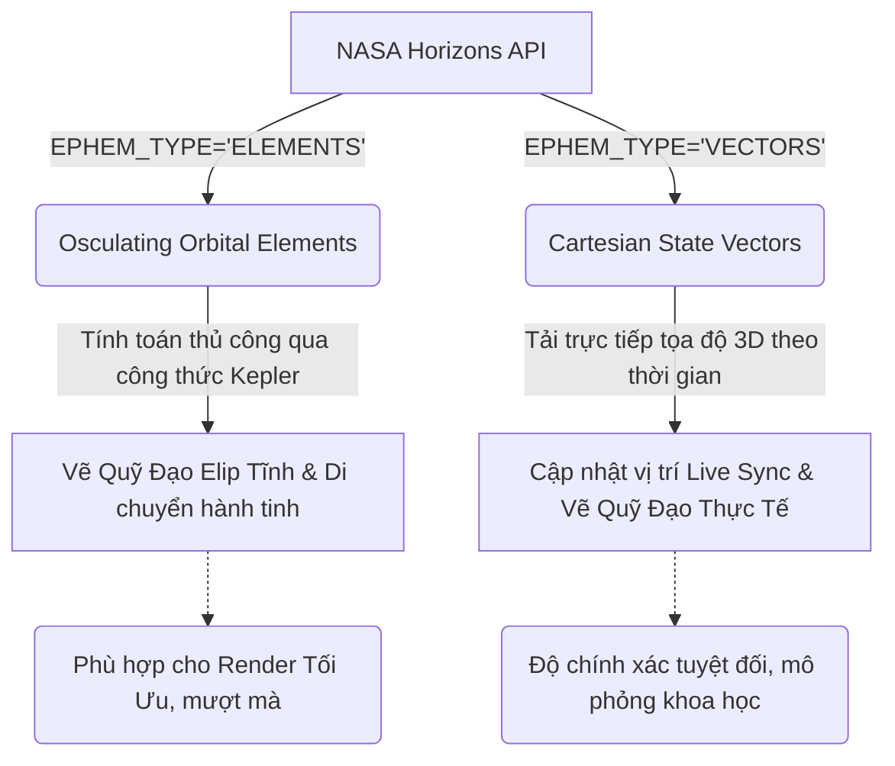

# Kế Hoạch Tích Hợp NASA JPL Horizons API Cho Mô Phỏng Hệ Mặt Trời 3D

Tài liệu này trình bày chi tiết nghiên cứu về **NASA JPL Horizons System**, một hệ thống cung cấp lịch thiên văn và dữ liệu động lực học chính xác bậc nhất thế giới dành cho các thiên thể trong Hệ Mặt Trời. Đồng thời, tài liệu đề xuất một kế hoạch tích hợp thực tế nhằm nâng cấp độ chính xác vật lý, quỹ đạo, và trạng thái thời gian thực (Real-time Sync) của các hành tinh và vệ tinh trong ứng dụng mô phỏng 3D hiện tại.

---

## 1. Tổng Quan Về NASA JPL Horizons System

Hệ thống **Horizons** được phát triển và vận hành bởi **Nhóm Động lực học Hệ Mặt Trời (Solar System Dynamics Group - SSD)** thuộc **Phòng Thí nghiệm Phản lực và Phóng tên lửa của NASA (JPL)**. 

### 1.1. Khả Năng Cốt Lõi
*   **Kho dữ liệu khổng lồ**: Lưu trữ thông tin của hơn **1.3 triệu tiểu hành tinh**, **3.800 sao chổi**, **8 hành tinh lớn**, **290+ vệ tinh tự nhiên**, Mặt Trời và hàng chục tàu vũ trụ nghiên cứu.
*   **Độ chính xác chuẩn khoa học**: Tính toán tọa độ và vận tốc dựa trên các mô hình số tích phân cao cấp nhất của NASA như **DE440** và **DE441** (Development Ephemerides).
*   **Đa dạng giao diện**: Truy cập thông qua Web UI, Telnet, Email hoặc trực tiếp thông qua **REST API** (CGI/REST).

### 1.2. API Endpoint Chính
NASA JPL cung cấp một API RESTful công khai để truy vấn trực tiếp Horizons mà không cần đăng ký tài khoản (không yêu cầu API Key):

*   **Base URL chính**: `https://ssd.jpl.nasa.gov/api/horizons.api`
*   **Base URL tra cứu (Lookup)**: `https://ssd-api.jpl.nasa.gov/doc/horizons_lookup.html` (dành cho việc tìm kiếm ID chính thức của các thiên thể nhỏ).

---

## 2. Kiến Trúc Tham Số Của Horizons API

Để thực hiện một yêu cầu HTTP GET, các tham số truy vấn (Query Parameters) phải được mã hóa URL (URL-encoded). Dưới đây là bảng phân tích chi tiết các tham số quan trọng nhất:

### 2.1. Các Tham Số Yêu Cầu Chung

| Tham số | Giá trị tiêu biểu | Mô tả |
| :--- | :--- | :--- |
| `format` | `'json'` / `'text'` | Định dạng phản hồi. Khuyên dùng `'json'` để dễ xử lý metadata trong ứng dụng Node.js, tuy nhiên bảng dữ liệu chính vẫn trả về dưới dạng văn bản thô nằm trong trường `result`. |
| `COMMAND` | Ví dụ: `'499'` (Sao Hỏa) | Mã ID hoặc tên của thiên thể mục tiêu. Đối với các hành tinh lớn, sử dụng SPK-ID chính thức. |
| `OBJ_DATA` | `'YES'` / `'NO'` | Bật `'YES'` để nhận các thông số vật lý tĩnh của hành tinh (khối lượng, bán kính, chu kỳ tự quay, độ phản xạ, obliquity). |
| `MAKE_EPHEM` | `'YES'` / `'NO'` | Bật `'YES'` để yêu cầu sinh lịch thiên văn (quỹ đạo/tọa độ) theo thời gian. |
| `EPHEM_TYPE` | `'VECTORS'` / `'ELEMENTS'` / `'OBSERVER'` | **VECTORS**: Tọa độ và vận tốc Cartesian 3D.<br>**ELEMENTS**: Các phần tử quỹ đạo Keplerian.<br>**OBSERVER**: Dữ liệu góc quan sát từ Trái Đất (RA/DEC). |
| `CENTER` | Ví dụ: `'500@10'` (Sun Center) | Gốc tọa độ. `'500@10'` lấy tọa độ Heliocentric (quanh Mặt Trời). `'500@399'` lấy tọa độ Geocentric (quanh Trái Đất). |
| `START_TIME` | Ví dụ: `'2026-05-18'` | Ngày bắt đầu lấy dữ liệu (định dạng YYYY-MM-DD hoặc Epoch cụ thể). |
| `STOP_TIME` | Ví dụ: `'2026-05-20'` | Ngày kết thúc lấy dữ liệu. |
| `STEP_SIZE` | Ví dụ: `'1 d'`, `'1 h'`, `'10'` | Bước nhảy thời gian. `'1 d'` là 1 ngày, `'1 h'` là 1 giờ. Nếu chỉ điền một số nguyên (ví dụ: `'10'`), hệ thống sẽ tự động chia đều khoảng thời gian thành 10 phần. |

> [!WARNING]
> Mọi ký tự đặc biệt trong giá trị tham số (như khoảng trắng trong `'1 d'` hay dấu `@` trong `'500@10'`) bắt buộc phải được mã hóa URL. Ví dụ: `STEP_SIZE='1%20d'` và `CENTER='500%4010'`.

---

## 3. Phân Tích Các Loại Dữ Liệu Lịch Thiên Văn

Đối với một ứng dụng mô phỏng 3D như **Solar System Cat**, chúng ta có hai cách tiếp cận chính để dựng quỹ đạo và vị trí của các hành tinh:



### 3.1. Dữ Liệu Phần Tử Quỹ Đạo Kepler (`EPHEM_TYPE='ELEMENTS'`)
Khi cấu hình `EPHEM_TYPE='ELEMENTS'`, API sẽ trả về các **Osculating Orbital Elements** (phần tử quỹ đạo dao động) đặc trưng cho quỹ đạo elip của vật thể tại một thời điểm cụ thể. Dữ liệu này dùng để cập nhật cấu trúc `orbit` trong [solar-system.json](file:///d:/solarsystemcat/public/data/solar-system.json).

#### Ánh xạ các tham số từ Horizons sang `solar-system.json`:

| Ký hiệu khoa học | Tham số trong Horizons | Mô tả | Ánh xạ JSON |
| :---: | :--- | :--- | :--- |
| $a$ | **`A`** | Semi-major axis (Bán trục lớn) - Đơn vị: AU | `orbit.semiMajorAxis` |
| $e$ | **`EC`** | Eccentricity (Độ lệch tâm) - Phạm vi [0, 1) | `orbit.eccentricity` |
| $i$ | **`IN`** | Inclination (Độ nghiêng quỹ đạo so với hoàng đạo) - Đơn vị: Độ | `orbit.inclination` |
| $P$ | **`PER`** | Orbital Period (Chu kỳ quỹ đạo) - Đơn vị: Ngày/Năm | `orbit.orbitalPeriod` |
| $\Omega$ | **`OM`** | Longitude of Ascending Node (Kinh độ nút lên) - Đơn vị: Độ | `orbit.longitudeOfAscendingNode` (mở rộng) |
| $\omega$ | **`W`** | Argument of Perihelion (Đối số cận điểm) - Đơn vị: Độ | `orbit.argumentOfPerihelion` (mở rộng) |
| $M$ | **`MA`** | Mean Anomaly (Góc dị thường trung bình tại Epoch) - Đơn vị: Độ | `orbit.meanAnomaly` (mở rộng) |

### 3.2. Dữ Liệu Vector Tọa Độ 3D (`EPHEM_TYPE='VECTORS'`)
Khi cấu hình `EPHEM_TYPE='VECTORS'`, API trả về vector tọa độ Cartesian $x, y, z$ (đơn vị AU hoặc KM) và vector vận tốc $v_x, v_y, v_z$ (đơn vị AU/ngày hoặc KM/giây).

#### Cấu trúc dòng dữ liệu mẫu trong response:
```text
2459000.500000000 = A.D. 2020-May-24 00:00:00.0000 TDB
 X = 1.402390875412E+00 Y =-6.402390871234E-01 Z =-3.012390871234E-02
 VX=-3.123908754120E-03 VY= 1.102390871234E-02 VZ= 3.123908712340E-04
```

#### Công thức chuyển đổi tọa độ sang WebGL/Three.js:
Trong vũ trụ của NASA, hệ tọa độ Cartesian mặc định có:
*   Mặt phẳng $X-Y$ là mặt phẳng Hoàng đạo (Ecliptic).
*   Trục $Z$ vuông góc với mặt phẳng hoàng đạo.

Trong Three.js, thông thường chúng ta thiết kế:
*   Mặt phẳng quỹ đạo nằm trên mặt phẳng nằm ngang $X-Z$.
*   Trục $Y$ hướng lên trên đại diện cho chiều cao thẳng đứng.

Do đó, công thức chuyển đổi tọa độ từ Horizons sang Three.js sẽ là:
$$X_{\text{Three.js}} = X_{\text{NASA}} \times \text{ScaleFactor}$$
$$Y_{\text{Three.js}} = Z_{\text{NASA}} \times \text{ScaleFactor}$$
$$Z_{\text{Three.js}} = -Y_{\text{NASA}} \times \text{ScaleFactor}$$
*(Trong đó $\text{ScaleFactor}$ là hệ số tỉ lệ thu nhỏ khoảng cách để phù hợp với không gian hiển thị 3D).*

---

## 4. Trích Xuất Tham Số Vật Lý Thực Tế (`OBJ_DATA='YES'`)

Khi bật tham số `OBJ_DATA='YES'`, Horizons API đính kèm một khối dữ liệu văn bản chứa các thông số vật lý của vật thể ở đầu phản hồi. Dưới đây là danh sách các thuộc tính hữu ích nhất cho dự án 3D Solar System và cách chúng ta ánh xạ để cập nhật [solar-system.json](file:///d:/solarsystemcat/public/data/solar-system.json):

```text
*******************************************************************************
Physical parameters (KM, SEC, rotational period in hours):
  Equator radius (km) = 3396.19+-0.1     Mass (10^24 kg)      = 0.64171
  Density (g/cm^3)    = 3.9335           Rot. Period          = 24.622962 h
  Obliquity to orbit  = 25.19 deg        Albedo               = 0.150
*******************************************************************************
```

### Ánh xạ tham số vật lý:
1.  **Bán kính thực tế (`radius`):** `Equator radius (km)` $\rightarrow$ Chuyển thành bán kính tỉ lệ so với Trái Đất (với Bán kính Trái Đất chuẩn $R_{\oplus} \approx 6378.1$ km).
2.  **Khối lượng (`massKg`):** `Mass (10^24 kg)` $\rightarrow$ Nhân với $10^{24}$ để đưa về kg chuẩn.
3.  **Mật độ (`density`):** `Density (g/cm^3)` $\rightarrow$ Giữ nguyên đơn vị $g/cm^3$.
4.  **Độ nghiêng trục quay (`axialTilt`):** `Obliquity to orbit` $\rightarrow$ Lưu vào `rotation.axialTilt` (Độ).
5.  **Chu kỳ tự quay (`rotationPeriod`):** `Rot. Period` (giờ) $\rightarrow$ Lưu vào `rotation.rotationPeriod` (Đơn vị: giờ).

---

## 5. Kịch Bản Tích Hợp & Tự Động Hóa (Automation Script)

Để hiện thực hóa việc lấy dữ liệu động từ NASA và cập nhật trực tiếp vào file JSON của dự án, chúng tôi đã thiết kế một **Node.js Script chuyên dụng**. Script này tự động thực hiện cuộc gọi API, parse phần văn bản thô để trích xuất các giá trị số và ghi đè một cách an toàn vào cấu trúc dữ liệu của dự án.

> [!TIP]
> Bạn có thể chạy script này định kỳ thông qua một CI/CD pipeline (như GitHub Actions) hoặc tích hợp một nút **"NASA Live Sync"** trực tiếp trên giao diện Admin/UI của ứng dụng để cập nhật tức thì.

Dưới đây là mã nguồn của script tự động hóa:

```javascript
// scripts/sync-nasa-horizons.js
import axios from 'axios';
import fs from 'fs';
import path from 'path';

const SOLAR_SYSTEM_JSON_PATH = path.resolve('./public/data/solar-system.json');

// Bản đồ ánh xạ ID hành tinh trong JSON sang mã COMMAND của NASA Horizons
const TARGET_MAP = {
  "mercury": { cmd: "199", parent: "10" }, // 199 = Mercury Barycenter, 10 = Sun
  "venus":   { cmd: "299", parent: "10" },
  "earth":   { cmd: "399", parent: "10" },
  "mars":    { cmd: "499", parent: "10" },
  "jupiter": { cmd: "599", parent: "10" },
  "saturn":  { cmd: "699", parent: "10" },
  "uranus":  { cmd: "799", parent: "10" },
  "neptune": { cmd: "899", parent: "10" },
  "pluto":   { cmd: "999", parent: "10" },
  "moon":    { cmd: "301", parent: "399" } // Moon quanh Trái Đất (399)
};

/**
 * Hàm lấy dữ liệu orbital elements từ NASA Horizons
 */
async function fetchOrbitalElements(targetCmd, centerCmd) {
  const url = `https://ssd.jpl.nasa.gov/api/horizons.api`;
  const params = {
    format: 'json',
    COMMAND: `'${targetCmd}'`,
    CENTER: `'500@${centerCmd}'`, // Gốc tọa độ (ví dụ quanh Mặt Trời 500@10)
    MAKE_EPHEM: "'YES'",
    EPHEM_TYPE: "'ELEMENTS'",
    START_TIME: "'2026-05-18'", // Ngày hiện tại mô phỏng
    STOP_TIME: "'2026-05-19'",
    STEP_SIZE: "'1 d'",
    OBJ_DATA: "'YES'"
  };

  try {
    const response = await axios.get(url, { params });
    return response.data;
  } catch (error) {
    console.error(`Lỗi khi fetch dữ liệu cho object ${targetCmd}:`, error.message);
    return null;
  }
}

/**
 * Phân tích dữ liệu văn bản từ NASA Horizons để trích xuất các thuộc tính vật lý và quỹ đạo
 */
function parseHorizonsResponse(data) {
  const text = data.result;
  if (!text) return null;

  const result = {
    physical: {},
    orbit: {}
  };

  // 1. Trích xuất thông số vật lý bằng biểu thức chính quy (Regex)
  const massMatch = text.match(/Mass\s*\(10\^24\s*kg\)\s*=\s*([\d.+-]+)/i) || text.match(/Mass\s*x10\^24\s*\(kg\)\s*=\s*([\d.+-]+)/i);
  const densityMatch = text.match(/Density\s*\(g\/cm\^3\)\s*=\s*([\d.]+)/i);
  const rotPeriodMatch = text.match(/Rot\.\s*Period\s*=\s*([\d.]+)\s*h/i) || text.match(/Rot\.\s*period\s*=\s*([\d.]+)\s*d/i);
  const obliquityMatch = text.match(/Obliquity\s*to\s*orbit\s*\[?deg\]?\s*=\s*([\d.-]+)/i) || text.match(/IAU76\s*obliquity\s*=\s*([\d.-]+)/i);

  if (massMatch) result.physical.massKg = parseFloat(massMatch[1]) * 1e24;
  if (densityMatch) result.physical.density = parseFloat(densityMatch[1]);
  if (rotPeriodMatch) {
    // Nếu đơn vị là ngày (d), nhân với 24 để đổi ra giờ
    const rawVal = parseFloat(rotPeriodMatch[1]);
    result.rotationPeriod = rotPeriodMatch[0].includes('d') ? rawVal * 24 : rawVal;
  }
  if (obliquityMatch) result.axialTilt = parseFloat(obliquityMatch[1]);

  // 2. Trích xuất Osculating Elements (Nằm giữa cặp ký tự $$SOE và $$EOE)
  const soeIdx = text.indexOf('$$SOE');
  const eoeIdx = text.indexOf('$$EOE');

  if (soeIdx !== -1 && eoeIdx !== -1) {
    const dataBlock = text.slice(soeIdx + 5, eoeIdx).trim();
    // Bóc tách các biến EC, IN, OM, W, A, PER từ bảng
    const ecMatch = dataBlock.match(/EC=\s*([\d.E+-]+)/);
    const inMatch = dataBlock.match(/IN=\s*([\d.E+-]+)/);
    const aMatch  = dataBlock.match(/A=\s*([\d.E+-]+)/);
    const perMatch = dataBlock.match(/PER=\s*([\d.E+-]+)/);

    if (ecMatch) result.orbit.eccentricity = parseFloat(ecMatch[1]);
    if (inMatch) result.orbit.inclination = parseFloat(inMatch[1]);
    if (aMatch)  result.orbit.semiMajorAxis = parseFloat(aMatch[1]);
    if (perMatch) result.orbit.orbitalPeriod = parseFloat(perMatch[1]); // Mặc định là Julian Years hoặc ngày tùy cấu hình
  }

  return result;
}

/**
 * Tiến trình chính: Đồng bộ dữ liệu
 */
async function sync() {
  console.log("=== Bắt đầu đồng bộ hóa dữ liệu với NASA JPL Horizons API ===");
  
  if (!fs.existsSync(SOLAR_SYSTEM_JSON_PATH)) {
    console.error("Không tìm thấy file solar-system.json tại:", SOLAR_SYSTEM_JSON_PATH);
    return;
  }

  const fileContent = fs.readFileSync(SOLAR_SYSTEM_JSON_PATH, 'utf8');
  const solarSystemData = JSON.parse(fileContent);

  for (const body of solarSystemData.bodies) {
    const config = TARGET_MAP[body.id];
    if (!config) continue;

    console.log(`Đang đồng bộ thiên thể: ${body.name.en} (NASA ID: ${config.cmd})...`);
    const apiData = await fetchOrbitalElements(config.cmd, config.parent);
    
    if (apiData) {
      const parsed = parseHorizonsResponse(apiData);
      if (parsed) {
        // Cập nhật các thông số quỹ đạo
        if (Object.keys(parsed.orbit).length > 0) {
          body.orbit = { ...body.orbit, ...parsed.orbit };
          console.log(`  -> Đã cập nhật Orbit: Bán trục lớn = ${body.orbit.semiMajorAxis} AU, Độ lệch tâm = ${body.orbit.eccentricity}`);
        }

        // Cập nhật thông số vật lý
        if (parsed.physical.massKg) body.physical.massKg = parsed.physical.massKg;
        if (parsed.physical.density) body.physical.density = parsed.physical.density;
        if (parsed.rotationPeriod) body.rotation.rotationPeriod = parsed.rotationPeriod;
        if (parsed.axialTilt) body.rotation.axialTilt = parsed.axialTilt;
        
        console.log(`  -> Đã cập nhật Physical: Khối lượng = ${body.physical.massKg} kg, Trục nghiêng = ${body.rotation.axialTilt}°`);
      }
    }
  }

  // Ghi dữ liệu mới xuống file
  fs.writeFileSync(SOLAR_SYSTEM_JSON_PATH, JSON.stringify(solarSystemData, null, 2), 'utf8');
  console.log("=== Hoàn tất đồng bộ! File solar-system.json đã được cập nhật thành công ===");
}

sync();
```

---

## 6. Kế Hoạch Nâng Cấp Trải Nghiệm Người Dùng (UX/UI Upgrade)

Việc tích hợp dữ liệu thời gian thực từ NASA Horizons mở ra những tính năng vô cùng độc đáo để nâng tầm sản phẩm:

### 6.1. Tính Năng "Real-time Live Position" (Đồng Bộ Vị Trí Thực Tế)
*   **Trải nghiệm**: Người dùng có thể nhấn nút **"NASA Live Sync"** trên thanh điều khiển.
*   **Kỹ thuật**: Ứng dụng sẽ tính toán ngày giờ hiện tại của hệ thống máy tính người dùng, gửi yêu cầu lấy State Vector (`EPHEM_TYPE='VECTORS'`) từ NASA Horizons, và lập tức dịch chuyển tọa độ 3D của các hành tinh trong cảnh quan Three.js đến đúng vị trí thực tế của chúng ngoài vũ trụ ngay tại giây phút đó.

### 6.2. Hiển Thị Quỹ Đạo Kepler Thực Tế
*   Thay vì vẽ các vòng tròn đồng tâm đơn giản xung quanh Mặt Trời, chúng ta sử dụng $a, e, i, \Omega, \omega$ lấy từ Horizons để vẽ các đường Ellipse chuẩn xác trong không gian 3D. 
*   **Lợi ích**: Người dùng sẽ thấy rõ Sao Diêm Vương (Pluto) có quỹ đạo nghiêng ($17.2^\circ$) và cắt qua quỹ đạo của Sao Hải Vương, hoặc Sao Thủy có quỹ đạo lệch tâm rõ rệt ($e = 0.2056$), tạo ra một bài học trực quan sinh động về thiên văn học vũ trụ.

### 6.3. Bảng Tra Cứu Thông Số Khoa Học (NASA Scientific Datasheet)
*   Trong bảng thông tin hành tinh (Information Panel), thêm một tab phụ tên là **"NASA Specs"** hiển thị nguyên bản dữ liệu vật lý được trích xuất từ Horizons kèm liên kết dẫn đến trang chủ JPL SSD, tạo độ tin cậy và học thuật cực cao cho ứng dụng.

---

> [!NOTE]
> Kế hoạch này sẵn sàng được thực thi. Bạn có thể yêu cầu tôi cài đặt script tự động hóa trên để bắt đầu cập nhật dữ liệu hoặc nâng cấp công cụ render quỹ đạo Three.js dựa trên các tham số Kepler chuẩn xác thu thập được từ NASA!
