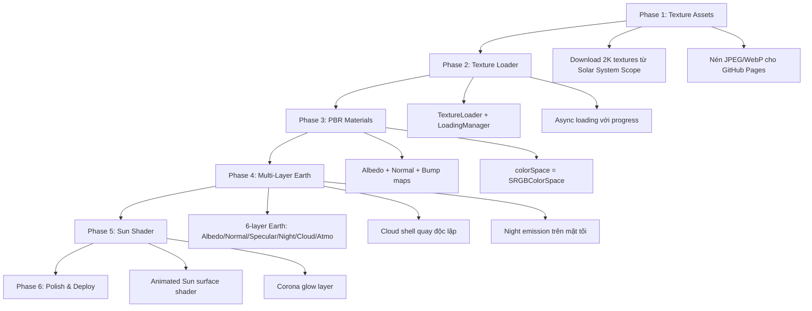
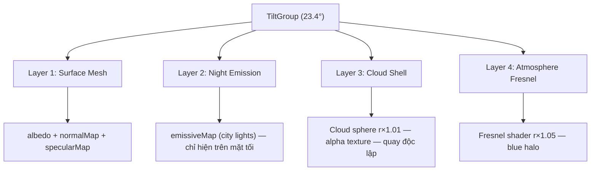

# 🪐 Kế Hoạch Nâng Cao Chất Lượng Bề Mặt Hệ Mặt Trời 3D

> **Dự án:** Solar System 3D — Surface Quality Enhancement  
> **Trạng thái hiện tại:** Tất cả thiên thể đang dùng **màu fallback đơn sắc** (không có texture)  
> **Mục tiêu:** Đưa chất lượng bề mặt lên cấp độ **photorealistic** với PBR textures + advanced shaders

---

## 📊 Đánh Giá Hiện Trạng

### Vấn đề cốt lõi
- **10 thư mục texture tồn tại nhưng hoàn toàn RỖNG** — không có file texture nào
- `createPlanet.js` **không có logic tải texture** — chỉ gán `FALLBACK_COLORS`
- Mặt Trời dùng `MeshBasicMaterial` với màu đơn sắc, không có texture bề mặt
- Trái Đất thiếu hoàn toàn 5/6 layer (Normal, Specular, Night, Clouds, Atmosphere texture)

### Ảnh chụp hiện tại

````carousel

<!-- slide -->

<!-- slide -->

````

---

## 🏗️ Kiến Trúc Nâng Cấp



---

## Phase 1: Thu Thập Texture Assets
**Thời gian ước tính:** 30 phút

### 1.1 Nguồn texture
- **Chính:** [Solar System Scope](https://www.solarsystemscope.com/textures/) (CC BY 4.0)
- **Phụ:** [Planet Pixel Emporium](https://planetpixelemporium.com/planets.html)

### 1.2 Bảng texture cần tải

| Thiên thể | Albedo | Normal/Bump | Specular | Night | Cloud | Res |
|-----------|--------|-------------|----------|-------|-------|-----|
| Mặt Trời | ✅ `sun_albedo.jpg` | — | — | — | — | 2K |
| Sao Thủy | ✅ `mercury_albedo.jpg` | ✅ Bump | — | — | — | 2K |
| Sao Kim | ✅ Surface + ✅ Atmosphere | — | — | — | — | 2K |
| Trái Đất | ✅ `earth_albedo.jpg` | ✅ Normal | ✅ | ✅ City lights | ✅ Cloud alpha | 2K |
| Sao Hỏa | ✅ `mars_albedo.jpg` | ✅ Bump | — | — | — | 2K |
| Sao Mộc | ✅ `jupiter_albedo.jpg` | — | — | — | — | 2K |
| Sao Thổ | ✅ `saturn_albedo.jpg` | — | — | — | — | 2K |
| Thiên Vương | ✅ `uranus_albedo.jpg` | — | — | — | — | 2K |
| Hải Vương | ✅ `neptune_albedo.jpg` | — | — | — | — | 2K |
| Diêm Vương | ✅ `pluto_albedo.jpg` | — | — | — | — | 1K |

### 1.3 Cấu trúc thư mục đích
```
public/textures/planets/
├── sun/albedo.jpg          (~200KB)
├── mercury/albedo.jpg, bump.jpg
├── venus/surface.jpg, atmosphere.jpg
├── earth/albedo.jpg, normal.jpg, specular.jpg, night.jpg, clouds.png
├── mars/albedo.jpg, bump.jpg
├── jupiter/albedo.jpg
├── saturn/albedo.jpg, ring.png
├── uranus/albedo.jpg
├── neptune/albedo.jpg
└── pluto/albedo.jpg
```

### 1.4 Giới hạn kích thước
- Tổng tất cả textures: **< 30MB** (giới hạn GitHub Pages)
- Mỗi file: JPEG quality 80%, resolution 2048×1024
- Earth clouds: PNG (cần alpha channel)

---

## Phase 2: Texture Loading System
**Thời gian ước tính:** 1 giờ

### 2.1 Tạo `textureLoader.js` — Module quản lý tải texture

**Chức năng:**
- Singleton `THREE.TextureLoader` + `THREE.LoadingManager`
- Progress bar cập nhật % tải realtime
- Fallback graceful khi texture không tồn tại
- Tự động set `colorSpace = THREE.SRGBColorSpace` cho albedo maps

### 2.2 Cập nhật Loading UI
- Progress bar hiện tại → hiển thị số file đã tải / tổng
- Fade-out smooth khi tải xong

### 2.3 Xử lý base path cho GitHub Pages
- Tất cả đường dẫn texture phải tương thích `import.meta.env.BASE_URL`
- Hoặc dùng Vite public directory (đã cấu hình đúng)

---

## Phase 3: Nâng Cấp PBR Materials
**Thời gian ước tính:** 2 giờ

### 3.1 Cập nhật `createPlanet.js`

Thay đổi cốt lõi — từ fallback colors sang texture-based PBR:

```diff
- material = new THREE.MeshStandardMaterial({
-   color: FALLBACK_COLORS[data.id] || 0xaaaaaa,
-   roughness: 0.8,
-   metalness: 0.1,
- });
+ const textures = loadPlanetTextures(data);
+ material = new THREE.MeshStandardMaterial({
+   map: textures.albedo,           // Color map
+   normalMap: textures.normal,      // Surface relief
+   bumpMap: textures.bump,          // Height displacement
+   bumpScale: 0.05,
+   roughnessMap: textures.specular, // Roughness variation
+   roughness: 0.8,
+   metalness: 0.1,
+   color: FALLBACK_COLORS[data.id], // Fallback if no texture
+ });
```

### 3.2 Bảng cấu hình Material theo thiên thể

| Thiên thể | Material Type | roughness | metalness | bumpScale | Ghi chú |
|-----------|--------------|-----------|-----------|-----------|---------|
| Mặt Trời | `MeshBasicMaterial` | — | — | — | Thay bằng custom ShaderMaterial (Phase 5) |
| Sao Thủy | `MeshStandardMaterial` | 0.95 | 0.0 | 0.04 | Bề mặt khô, nhiều crater |
| Sao Kim | `MeshStandardMaterial` | 0.7 | 0.0 | — | Atmosphere texture che surface |
| Trái Đất | `MeshStandardMaterial` | 0.7 | 0.1 | — | normalMap thay bump, specular cho đại dương |
| Sao Hỏa | `MeshStandardMaterial` | 0.9 | 0.0 | 0.06 | Sa mạc oxide sắt |
| Sao Mộc | `MeshStandardMaterial` | 0.85 | 0.0 | — | Dải mây khí, không có địa hình |
| Sao Thổ | `MeshStandardMaterial` | 0.85 | 0.0 | — | Tương tự Jupiter |
| Thiên Vương | `MeshStandardMaterial` | 0.6 | 0.0 | — | Methane ice surface |
| Hải Vương | `MeshStandardMaterial` | 0.6 | 0.0 | — | Methane clouds |
| Diêm Vương | `MeshStandardMaterial` | 0.9 | 0.0 | — | Ice + rock |

---

## Phase 4: Multi-Layer Earth (Trái Đất 6 Lớp)
**Thời gian ước tính:** 2 giờ

### 4.1 Kiến trúc 6 Layer



### 4.2 Night Emission (Đèn đêm)
- Custom shader hoặc `emissiveMap` + `emissive: 0xffffff`
- Sử dụng dot product với hướng ánh sáng để chỉ hiện trên mặt tối
- Alternative: ShaderMaterial blend giữa day map và night map

### 4.3 Cloud Shell
- Sphere geometry `radius × 1.01`
- `MeshStandardMaterial` với `alphaMap: cloudTexture`
- `transparent: true`, `depthWrite: false`
- Quay `rotation.y` với tốc độ khác bề mặt (giả lập gió)

### 4.4 Tích hợp vào Animation Loop
```javascript
// Trong animate():
if (body.data.id === 'earth' && body.cloudMesh) {
  body.cloudMesh.rotation.y += 0.0001 * deltaTime * timeScale;
}
```

---

## Phase 5: Nâng Cấp Mặt Trời (Sun Shader)
**Thời gian ước tính:** 1.5 giờ

### 5.1 Từ MeshBasicMaterial → Custom ShaderMaterial

Mặt Trời hiện tại chỉ là quả cầu màu vàng. Cần nâng lên:

**Layer 1: Surface Texture Animation**
- Albedo map + noise-based UV distortion
- Tạo hiệu ứng plasma bề mặt chuyển động

**Layer 2: Corona Glow**
- Lớp sphere bọc ngoài với additive blending
- Fresnel-based glow nhưng mạnh hơn atmosphere thông thường
- Kết hợp với UnrealBloomPass hiện có

### 5.2 GLSL Shader cho Sun Surface

```glsl
// Fragment shader - animated solar surface
uniform sampler2D uAlbedo;
uniform float uTime;

varying vec2 vUv;

void main() {
  // Distort UV theo thời gian để tạo hiệu ứng plasma
  vec2 uv = vUv;
  uv.x += sin(uv.y * 10.0 + uTime * 0.5) * 0.01;
  uv.y += cos(uv.x * 10.0 + uTime * 0.3) * 0.01;
  
  vec4 texColor = texture2D(uAlbedo, uv);
  
  // Boost brightness
  gl_FragColor = vec4(texColor.rgb * 1.5, 1.0);
}
```

### 5.3 Cập nhật Bloom
- Điều chỉnh `bloomPass.threshold` để Sun texture vẫn vượt ngưỡng bloom
- Tăng `bloomPass.strength` nhẹ nếu cần

---

## Phase 6: Polish & Deploy
**Thời gian ước tính:** 1 giờ

### 6.1 Performance Optimization
- Texture resolution: 2K cho inner planets, 2K cho gas giants, 1K cho outer
- JPEG quality 80% (đã nén)
- `texture.generateMipmaps = true` (mặc định Three.js)
- Dispose textures khi không visible (optional)

### 6.2 Venus Special: Atmosphere che Surface
- Surface texture phải bị ẩn bởi atmosphere layer đục
- Fresnel power = 2.0, opacity = 0.9 → gần như che toàn bộ
- Có thể thêm thêm một cloud sphere đục giữa surface và atmosphere

### 6.3 Attribution
- Thêm credit "Textures: Solar System Scope (CC BY 4.0)" vào UI

### 6.4 Deploy
- `npm run build` → kiểm tra texture bundling
- Push → GitHub Actions auto-deploy

---

## 📋 Thứ Tự Thực Hiện

```mermaid
gantt
    title Lộ Trình Nâng Cấp Bề Mặt
    dateFormat X
    axisFormat %s

    section Assets
    Phase 1 - Download Textures    :p1, 0, 30

    section Core Engine
    Phase 2 - Texture Loader       :p2, after p1, 60
    Phase 3 - PBR Materials        :p3, after p2, 120

    section Advanced
    Phase 4 - Multi-Layer Earth    :p4, after p3, 120
    Phase 5 - Sun Shader           :p5, after p4, 90

    section Deploy
    Phase 6 - Polish & Deploy      :p6, after p5, 60
```



> **Tổng thời gian ước tính: ~8 giờ**

---

## ✅ Checklist Nghiệm Thu

- [ ] Tất cả 10 thiên thể có texture bề mặt (không còn solid color)
- [ ] Sao Thủy: Bump map tái tạo crater
- [ ] Sao Kim: Atmosphere đục che surface
- [ ] Trái Đất: 6 layers hoạt động (day/night/normal/specular/cloud/atmo)
- [ ] Trái Đất: Cloud layer quay độc lập
- [ ] Trái Đất: City lights hiện trên mặt tối
- [ ] Sao Hỏa: Bump map tái tạo địa hình (Olympus Mons, Valles Marineris)
- [ ] Sao Mộc: Dải mây + Great Red Spot visible
- [ ] Sao Thổ: Surface texture + ring system
- [ ] Mặt Trời: Animated surface shader + bloom corona
- [ ] Loading progress bar hiển thị % tải texture
- [ ] Tổng dung lượng texture < 30MB
- [ ] Deploy thành công lên GitHub Pages
- [ ] Attribution "Solar System Scope CC BY 4.0" trong UI
